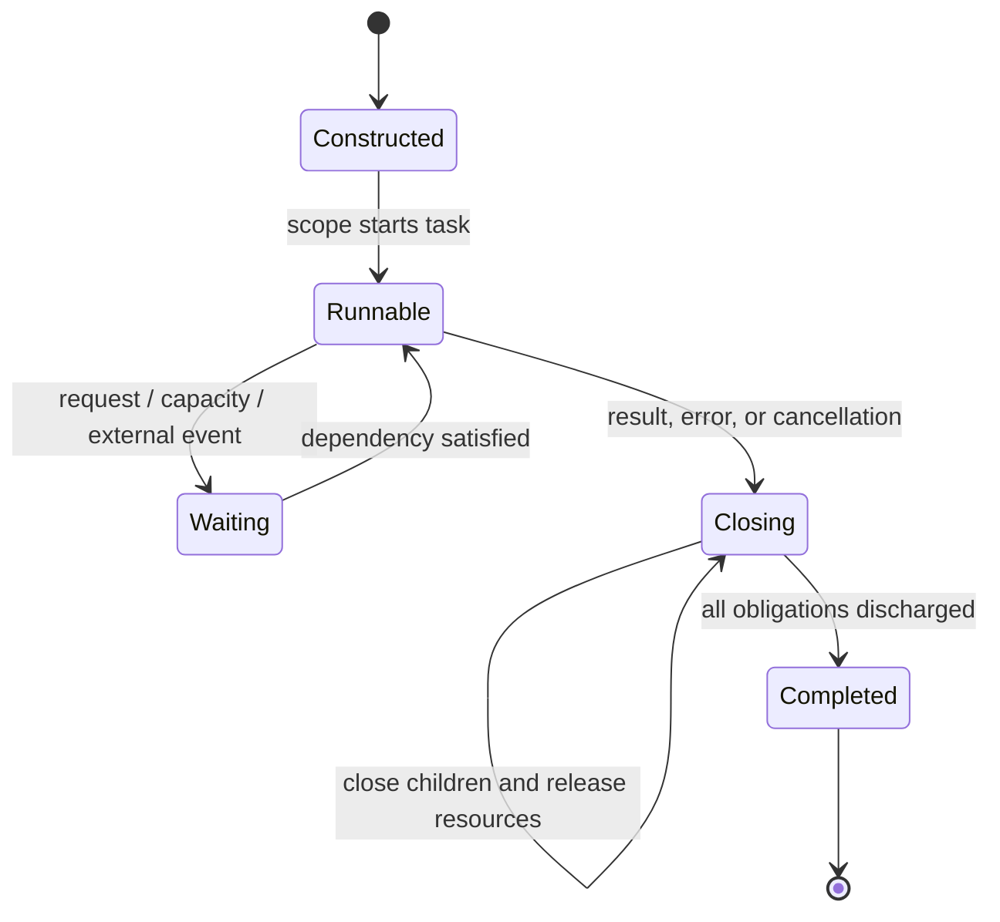
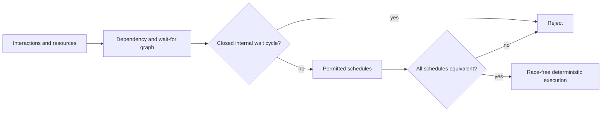

# Concurrency model

## Formal text

### TOPAL-CONC-ENTITY-001 — Execution entities

An isolated call is the smallest independently schedulable computation. A task
is a structured owner of state, endpoints, child scopes, and a serial event
processor. A task processes at most one state-mutating event at a time; isolated
pure calls spawned by that event may execute concurrently. Scheduling is not
observable except through declared effects. This realizes
`TOPAL-REQ-CONC-001` and `TOPAL-REQ-DETERMINISM-001`.

### TOPAL-CONC-SCOPE-001 — Structured lifetime

Every spawned call or task belongs to exactly one lexical task scope. A scope
may complete only after each child has returned, failed, been explicitly
detached through a declared application-lifetime capability, or completed its
cancellation protocol. Leaving by error, return, or termination initiates the
same closure obligations. No child may access a parent resource after the
resource's lifetime ends.

### TOPAL-CONC-INTERACT-001 — Interaction forms

Interaction is one of:

- event: enqueue input and return `Unit`, establishing no completion dependency;
- request: enqueue input and await exactly one typed result or declared error;
- stream: establish an ordered sequence of typed results with closure; or
- direct call: establish a completion dependency and return its typed result.

Each interaction names a task identity, endpoint identity, protocol state,
payload type, effects, and backpressure policy. A send transfers values and any
linear capabilities atomically at the semantic level. Failed enqueue transfers
nothing and returns its declared error.

### TOPAL-CONC-PROTOCOL-001 — Protocol transition system

A protocol is finite labeled transition system `P=(S,s₀,F,M,δ)` where states
`S`, initial state `s₀`, terminal states `F`, message labels `M`, and partial
transition function `δ:S×M→S×Obligation*` are static. An endpoint capability
carries one exact protocol identity, role, peer identity, and current state.
Sending or receiving label `m` is valid only when `δ(s,m)` exists and consumes
the old state capability to produce the new one. Branch selection is carried by
the message; peers never guess a transition.

Every linear endpoint reaches a terminal state or an explicit close/cancel
transition on every exit path. Unexpected labels, duplicate replies, use after
transition, and abandoned obligations are compile errors or validated boundary
errors before application code observes a message.

### TOPAL-CONC-ORDER-001 — Ordering

For each sender-endpoint pair, successful sends are observed in source
sequenced-before order. A receive is after its matching send. A reply is after
its request receive, and request completion is after its reply send. Task start
is after construction; task completion is after its last event and child-scope
closure. These edges contribute to memory-model `hb`.

Messages from independent senders are unordered unless the protocol, an
explicit dependency, or a shared effect orders them. A task's state-mutating
event processing selects one order permitted by those constraints. Acceptance
requires that all permitted selections have equivalent semantic results.

### TOPAL-CONC-DEPEND-001 — Dependency graph

For each scope, construct graph `G=(N,D)` whose nodes are outstanding calls,
tasks, requests, stream actions, completion obligations, resource releases, and
protocol transitions. Edge `a→b` means `a` must complete or transition before
`b` can do so. Edges arise from direct calls, awaited requests, joins, effect
ordering, resource ownership, protocol order, queue capacity, and explicit
`DependsOn` evidence.

`Independent`, `Conflicts`, `Aliases`, and `MayAlias` evidence is applied
conservatively: missing independence or disjointness may add edges but never
remove a possible dependency.

### TOPAL-CONC-DEADLOCK-001 — Internal deadlock freedom

An internal wait set is a nonempty set of live nodes each blocked only on
another node in the set. An accepted program shall prove that no reachable
state has an internal wait set. Equivalently, every reachable closed strongly
connected component of wait-for edges must contain a transition enabled
without completion from that component. Queue-capacity waits and resource
release obligations participate in this check.

Waiting solely for a declared external event, clock, peer, device, or
application shutdown is suspension, not internal deadlock. The dependency must
be typed as external and cannot be used to discharge an internal cycle.

### TOPAL-CONC-RACE-001 — Isolation and race freedom

Concurrent isolated calls may share immutable values. Mutable storage,
resources, endpoints, and task state require disjoint ownership, a linear
transfer, or an ordering edge sufficient under the [memory model](memory-model.md). If any
permitted schedule contains conflicting events unordered by happens-before, the
program is rejected. Runtime scheduling never repairs a statically unsafe
program.

### TOPAL-CONC-BACKPRESSURE-001 — Bounded communication

Every event or request protocol declares one admission behavior: bounded wait,
bounded rejection with a typed result, or contained loss for an isolated
diagnostic event. Queue capacity is an implementation choice within that
behavior. An ordinary `Unit` event is never silently dropped. A sender that may
suspend or fail exposes that outcome in its protocol and effect contract, and
the resulting capacity dependencies participate in deadlock analysis.

### TOPAL-CONC-CANCEL-001 — Cancellation and termination

Cancellation is a protocol event, not asynchronous destruction. It propagates
from a closing scope to children in dependency order. Each child reaches a
declared cancellation observation point, releases resources, resolves or
cancels outstanding replies and streams, and acknowledges completion. Forced
external termination may stop progress but shall not be reported as orderly
completion.

### TOPAL-CONC-DETERMINISM-001 — Schedule equivalence

Let two executions differ only in the order of events unordered by dependency,
protocol, effect, or `hb`. They shall produce equal returned semantic values,
errors, final protocol states, and ordered observable traces after quotienting
each trace by declared independent-event swaps. Reductions executed in parallel
shall carry verified associative evidence; unordered reductions additionally
require verified commutative evidence.

### TOPAL-CONC-PROGRESS-001 — Progress boundary

Race freedom, protocol fidelity, deterministic results, and absence of internal
deadlock do not depend on scheduler fairness. Revision `design-0` makes no claim
that every continuously runnable entity is eventually scheduled and therefore
makes no unconditional eventual-completion claim for a concurrent application.
Any liveness proof shall state its external progress and scheduler assumptions;
those assumptions do not remove internal wait cycles from deadlock analysis.

## Graphical presentation

## Explanatory notes

`Unit` means that a caller establishes no completion dependency; it does not
mean that an event has already run. `Completed` or a returned request result is
the corresponding evidence of completion. This distinction allows direct and
message-based implementations to share interfaces without hiding scheduling
dependencies.

The model guarantees internal deadlock freedom, not scheduler fairness or
success of the outside world. A server may wait forever for a network peer when
that external dependency is declared. Timeouts are ordinary races between a
reply transition and a clock transition, with the protocol defining exactly
which winner is observed and how the losing obligation is closed.
