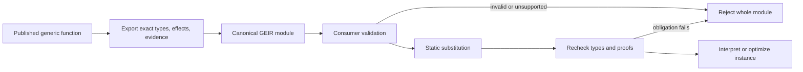

# Generic export intermediate language

## Formal text

### TOPAL-GIR-PURPOSE-001 — Artifact purpose

The Generic Export Intermediate Representation (GEIR) is a revisioned,
implementation-independent description of a published generic function's
semantic contract and typed body. It shall contain enough information to type
check, instantiate, optimize, or interpret the function without source text and
without weakening its guarantees. It shall not expose private declarations not
reachable through the published interface. This realizes
`TOPAL-REQ-GENERIC-001`.

### TOPAL-GIR-MODULE-001 — Abstract grammar

```text
Module      = { revision, language, imports[], identities[], types[],
                capabilities[], functions[], exports[] }
Function    = { id, static_parameters[], input_pattern, result_type,
                effects, guarantees, blocks[], entry }
Block       = { id, parameters[], instructions[], terminator }
Instruction = Const | Product | Project | Construct | Validate | Convert
            | Capability | Apply | Effect | PackExists | UnpackExists
            | BeginRegion | EndRegion
Terminator  = Return | Branch | Match | Yield | Suspend | TailApply
Type        = Primitive | Tuple | Record | Variant | Union | Constraint
            | Function | Existential | Nominal | Application | RecursiveRef
Evidence    = Identity | ConstraintProof | CapabilityProof | LawProof
            | EffectRelation | DecreasesProof | ProtocolProof
```

Arrays preserve order. Maps are encoded as arrays sorted by canonical key.
Every reference is an index into the applicable preceding table or a declared
recursive identity. Forward reference is forbidden except through
`RecursiveRef`. Unknown required fields reject the artifact; extension fields
marked `ignorable` may be preserved and ignored.

### TOPAL-GIR-ID-001 — Stable identities

Every published nominal object has identity `(package, module-path,
declaration-path, language-revision)`. Anonymous structural objects use the
SHA-256 digest of their canonical GEIR definition with all table indices
replaced by referenced canonical identities. Hash collision is an artifact
error unless byte-identical canonical definitions are present. Local SSA values
and blocks use dense zero-based indices scoped to one function.

### TOPAL-GIR-SSA-001 — Typed static single assignment

Each block parameter and instruction result is assigned exactly once and has
one declared exact type. A use shall be dominated by its definition. Each edge
supplies exactly the target block's parameter count and types. The entry block
has no predecessors and its parameters are the matched function inputs and
static evidence. A block ends in exactly one terminator.

### TOPAL-GIR-VALID-001 — Validation

Validation proceeds in this order:

1. validate framing, revision, canonical ordering, and table bounds;
2. resolve identities and imports against exact revisions;
3. validate kinds, type formation, recursion guards, and visibility;
4. validate SSA dominance and block-edge types;
5. rederive every instruction type and conservative effect;
6. verify capability coherence, proof trust, totality, and protocol state; and
7. confirm exports reveal no private identity or representation.

Failure at any step rejects the complete module. A consumer shall not execute,
instantiate, or cache a partially validated module.

### TOPAL-GIR-INST-001 — Generic instantiation

Instantiation is capture-avoiding substitution of static parameters with exact
objects satisfying their declared patterns and verified evidence obligations.
The consumer shall rerun affected type, effect, capability, and totality checks
after substitution. It may specialize or erase evidence only when the result
preserves the exact observable semantics and all published guarantees.

Two instantiations are equivalent iff their substituted canonical object
identities and retained evidence identities are equal. Compiler-local layout or
machine-code choices do not affect equivalence.

### TOPAL-GIR-EFFECT-001 — Operations and effects

Pure instructions have no observable event. `Effect` and effectful `Apply`
carry the exact declared effect identity, resource identities, dependencies,
and result/error types. Their order within a block and control-flow dependency
shall be preserved unless the effect relations prove a transformation
permitted. An optimizer may introduce mutation or parallel execution only when
the memory and concurrency specifications prove observational equivalence.

### TOPAL-GIR-EVIDENCE-001 — Evidence preservation

Safety-relevant evidence shall carry either a machine-checkable proof term in a
declared proof calculus or a reference to a verifier and immutable certificate
accepted by the language revision. `trusted-unverified` law evidence is retained
with that status and is never promoted by export. Evidence involving private
structure may be sealed behind a published claim identity but shall remain
checkable without revealing that structure.

### TOPAL-GIR-CANON-001 — Canonical form

Canonical GEIR uses UTF-8 strings normalized to NFC, unsigned minimal LEB128
integers, dense tables ordered by canonical identity bytes, sorted labeled
fields by declaration index, and no ignorable extension fields. Floating or
approximate constants are represented by semantic type identity and exact bit
pattern, not host text formatting. Canonicalization is idempotent. Equal modules
have byte-identical canonical form; byte-identical canonical modules have equal
semantics.

### TOPAL-GIR-COMPAT-001 — Revision compatibility

A consumer supports an artifact only when it supports the artifact revision,
language revision, all required feature identities, proof calculi, and imported
published identities. It shall reject unsupported input before instantiation.
No revision may reinterpret an existing opcode or field; changed meaning
requires a new revision or new opcode.

## Graphical presentation



## Explanatory notes

GEIR is semantic interchange, not a stable compiler-internal optimization IR.
Implementations may lower it into any internal form after validation. Source
locations and documentation may be carried as ignorable diagnostic extensions;
they do not affect canonical identity or semantics.

Closure reconstruction and foreign ABI linkage are outside `design-0`.
Published generic functions may refer only to representable GEIR operations and
resolvable published dependencies. A compiler must reject export when a body
depends on unavailable private semantics rather than emit an incomplete
artifact.
