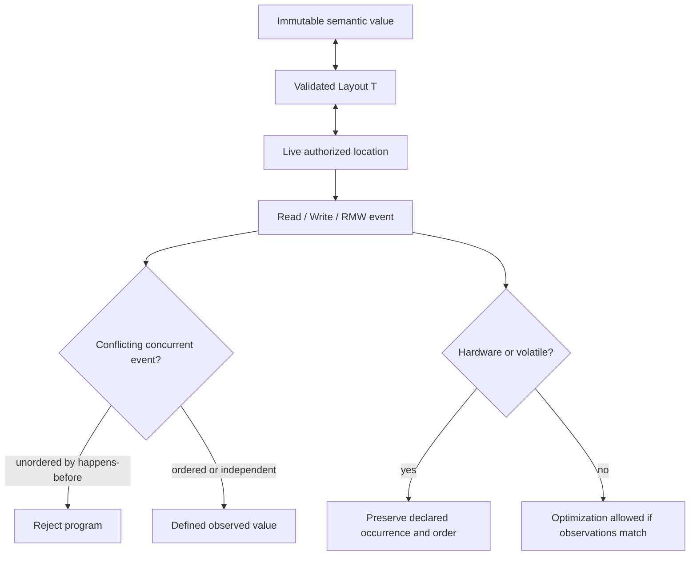

# Memory model

## Formal text

### TOPAL-MEM-DOMAINS-001 — Semantic and storage domains

Topal values are immutable semantic objects. Storage consists of finite address
ranges owned by resource identities. A `Layout T` maps between valid byte
sequences and semantic values of `T`; it is not a property of `T`. Compiler
mutation of unobservable storage and explicit access to declared locations are
the only mutations in `design-0`. This realizes `TOPAL-REQ-RESOURCE-001`.

### TOPAL-MEM-LOCATION-001 — Locations

A location is tuple `(resource, range, layout, rights, lifetime, access)` where:

- `range=[base,base+size)` uses mathematical natural addresses and shall not
  overflow the declared address width;
- `layout` has size not exceeding `range` and an alignment dividing `base`;
- `rights ⊆ {read,write}`;
- `lifetime` is a live lexical or protocol-governed region; and
- `access` declares legal widths, alignment, atomicity, volatility, and ordering.

Construction fails unless all properties are proved. Deriving a sublocation
requires a contained range and no stronger rights, lifetime, or access. Two
locations alias iff their resource identities are equal and their ranges
overlap; equal numeric addresses in different resources do not alias.

### TOPAL-MEM-EVENT-001 — Memory events

A permitted execution has finite or countably infinite event set `E`. A memory
event is:

`Read(e,l,n,a,o)`, `Write(e,l,n,v,a,o)`, or `RMW(e,l,n,vin,vout,a,o)`,

where `l` is a valid location, `n` is a declared access width, `a` is atomicity
(`plain` or one atomic identity), and `o` is ordering (`relaxed`, `acquire`,
`release`, `acq-rel`, or `seq-cst`). Volatile is a separate effect flag and
does not imply atomicity or cross-task synchronization.

Each event shall be within range, aligned, authorized, live, and permitted by
the location's access declaration. Failure to prove this rejects the program;
dynamic boundary validation returns an explicit error before an event occurs.

### TOPAL-MEM-REL-001 — Execution relations

Every execution defines:

- `sb`: strict per-call sequenced-before order;
- `mo_l`: strict total modification order of atomic writes/RMWs to atomic
  location identity `l`;
- `rf`: each successful read maps to exactly one write/RMW of the same atomic
  identity and width whose value it observes;
- `sw`: release-to-acquire synchronization when an acquire reads from the
  release or its release sequence; and
- `hb = (sb ∪ sw ∪ task-start ∪ task-complete ∪ message-transfer)⁺`.

`hb` shall be acyclic. `rf` shall not read from an event that follows the read
in `hb`. A sequentially consistent execution has one strict total order `S`
over all `seq-cst` events consistent with `hb` and every `mo_l`; each
`seq-cst` read observes the latest eligible write in `S`.

### TOPAL-MEM-PLAIN-001 — Plain access and data races

Two events conflict when they access overlapping bytes of one resource, at
least one writes, and they are not both reads or operations on the same atomic
identity. A data race is a conflicting pair from distinct isolated calls or
tasks unordered by `hb`. Every accepted safe program shall prove that no
permitted execution contains a data race. Inability to prove this is a compile
error. There is no execution with race-based undefined behavior.

A plain read observes the unique latest `hb`-preceding plain write applicable to
its bytes, or the initialized value if none exists. Acceptance requires that
this write be unique for every permitted execution. Tearing is forbidden unless
the location explicitly declares independently addressable subfields and the
read's layout is composed from those subfields.

### TOPAL-MEM-ATOMIC-001 — Atomic access

All operations on one atomic location identity use one declared width and
layout. Each atomic read observes exactly one write in `mo_l`, subject to `hb`
and ordering rules; it never tears. Relaxed operations guarantee atomicity and
modification order only. Acquire/release add `sw`; `seq-cst` additionally joins
`S`. Mixed atomic and plain conflicting access to one byte range is rejected.

Safe source has no general mutex primitive. Compiler-introduced synchronization
may use target facilities only when its behavior refines these relations and is
not observable as a source value.

### TOPAL-MEM-HARDWARE-001 — Hardware and volatile access

A volatile event is observable and shall occur exactly when demanded by the
source evaluation: it is not removed, duplicated, combined, invented, or moved
across an event ordered with it. Reads and writes use the sizes and alignments
declared by the access capability. Device side effects and interference are
constrained by declared effects and typestate protocols; absent independence
evidence they conflict conservatively.

Hardware declarations may strengthen ordering beyond the five atomic orders.
Such strengthening is represented as a named access capability with formal
relations; unsupported capabilities cause rejection, never weakening.

### TOPAL-MEM-LIFETIME-001 — Ownership and lifetime

A resource has one live ownership obligation. Moves transfer it and invalidate
the source binding. Non-owning capabilities cannot outlive the resource or the
state that authorizes them. Destruction occurs exactly once after all required
uses and non-owning capabilities end, including every success, error,
termination, and cancellation path. Resource cycles are rejected unless a
declared cycle-breaking protocol proves destruction.

### TOPAL-MEM-OPT-001 — Permitted optimization

An implementation transformation is valid iff, for every permitted source
execution, it produces the same semantic values, errors, protocol transitions,
and observable effect trace up to declared independence. It may alter layout,
allocate differently, mutate unique storage, coalesce nonobservable operations,
or execute independent work in parallel. It may not introduce an additional
permitted observation or remove a required one.

## Graphical presentation

## Explanatory notes

The model separates language values from their encodings so an integer has no
intrinsic endian, width, address, or alignment. Those properties belong to a
layout and location. Likewise, compiler-introduced mutation is an optimization
fact and cannot be discovered through safe source semantics.

The model intentionally turns uncertain unsafe behavior into conservative
rejection. External devices may change independently only when their declared
model permits it; such changes are external observations, not undefined
behavior. Foreign-language shared memory is outside `design-0`.
