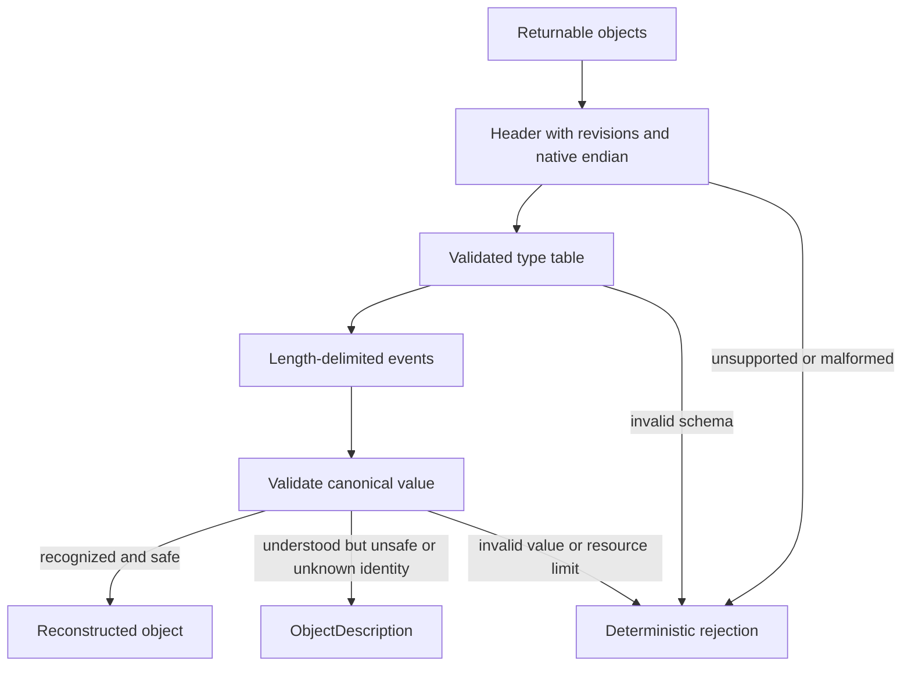

# Topal native serialization protocol

## Formal text

### TOPAL-LAYOUT-ENDIAN-001 — External layout byte order

`Little` and `Big` shall resolve the two nominal Endian policy values used by
explicit external layouts. They describe representation and do not change
native serialization byte order by themselves.

### TOPAL-LAYOUT-ACCESS-001 — Layout access policy

`ReadWrite`, `ReadOnly`, `WriteOnly`, and `Reserved` shall resolve nominal
external-layout access policies without granting runtime authority.

### TOPAL-LAYOUT-BIT-ORDER-001 — Storage-unit bit order

`MostSignificantFirst` and `LeastSignificantFirst` shall resolve nominal bit-order values.

### TOPAL-LAYOUT-PACKING-001 — Product packing

`Natural` and `Packed` shall resolve nominal product-packing policies.

### TOPAL-LAYOUT-FIELD-ORDER-001 — Declared field order

`Declared` shall resolve the policy retaining source declaration field order.

### TOPAL-LAYOUT-PAYLOAD-PLACEMENT-001 — Sum payload placement

`AfterTag` and `Overlay` shall resolve nominal tagged-sum payload policies.

### TOPAL-LAYOUT-ABSENCE-POLICY-001 — Absent length and terminator

`NoLength` and `NoTerminator` shall resolve distinct nominal layout policy
values; neither implies the other.

### TOPAL-SER-SCOPE-001 — Protocol scope

The native protocol represents the public semantic description of every object
that may be returned from a function. Representation does not grant authority
and does not promise reconstruction. Only a validated native stream is input to
`lang deserialize`; external formats are separate encodings. This realizes
`TOPAL-REQ-SERIAL-001`.

### TOPAL-SER-PRIMITIVE-001 — Primitive encodings

`uvarint` is unsigned LEB128 using the minimum number of octets. Values with an
overflowing final payload, more than ten octets for a 64-bit field, or a
nonminimal form are malformed. `bytes(n)` is exactly `n` octets. `text` is a
`uvarint` byte length followed by well-formed NFC UTF-8 without `U+0000`,
surrogates, or noncharacters. `u16`, `u32`, `u64`, and signed counterparts use
the stream byte order. Booleans are one octet, `00` or `01`; other values are
malformed.

### TOPAL-SER-HEADER-001 — Stream header

```text
Header = magic:bytes(8)                 # 54 4f 50 41 4c 53 45 52, "TOPALSER"
         protocol-major:uvarint
         protocol-minor:uvarint
         language-identity:text
         language-version:Version
         byte-order:u8                  # 0 little, 1 big
         flags:uvarint                  # design-0 requires zero
         type-count:uvarint
         event-count:uvarint            # UINT64_MAX means streaming/unknown

Version = major:uvarint minor:uvarint patch:uvarint build:uvarint
```

The initial protocol version is `1.0`. A receiver shall validate the complete
header and declared resource limits before reading type definitions. Unknown
major versions, unsupported language versions, invalid byte order, or unknown
flag bits reject the stream at the header boundary.

### TOPAL-SER-TYPE-001 — Type table

Exactly `type-count` definitions follow the header. IDs are their zero-based
table positions. A definition may refer only to an earlier ID or to its own
identity through an explicit `recursive` reference.

```text
TypeDef = identity:text kind:u8 payload-length:uvarint payload:bytes(payload-length)

kind 0  Unit       payload = empty
kind 1  Boolean    payload = empty
kind 2  Int    payload = signed:u8 width-bits:uvarint # zero selects arbitrary width
kind 3  Rational   payload = numerator-type:id denominator-type:id
kind 4  Text       payload = normalization:u8       # 0 means NFC
kind 5  Bytes      payload = empty
kind 6  Tuple      payload = count:uvarint component:id[count]
kind 7  Record     payload = count:uvarint (label:text type:id)[count]
kind 8  Variant    payload = count:uvarint (tag:uvarint label:text type:id)[count]
kind 9  Union      payload = count:uvarint alternative:id[count]
kind 10 Sequence   payload = element:id
kind 11 Set        payload = element:id order-identity:text
kind 12 Map        payload = key:id value:id order-identity:text
kind 13 Constraint payload = base:id predicate-identity:text
kind 14 Nominal    payload = public-definition:id
kind 15 Description payload = object-kind:text schema:id
kind 16 Recursive  payload = identity:text
```

Fixed widths are positive multiples of eight. `width-bits` zero selects the
arbitrary-width encoding from `TOPAL-SER-VALUE-001`; it is not a zero-bit
fixed-width integer. Duplicate identities, labels, tags, or
set/map keys are malformed. Tags are dense from zero in declaration order.
Type identities are stable within an immutable language revision. Payload
length permits a parser to preserve an understood description but does not
permit unknown kinds in protocol 1.x.

### TOPAL-SER-EVENT-001 — Event framing

```text
Event = frame-length:uvarint type-id:uvarint value:bytes(remaining-frame)
```

`frame-length` counts the encoded `type-id` and value. It must not exceed the
receiver's configured limit. A finite stream contains exactly `event-count`
events and then EOF. An unknown-count stream contains events until a zero
`frame-length` terminator and then EOF. Trailing octets are malformed. A frame
is emitted atomically at the logical stream level; physical producers may
yield its bytes incrementally.

### TOPAL-SER-VALUE-001 — Value encoding

Values are encoded recursively from their type definition:

- Unit has zero octets; Boolean uses its primitive encoding.
- Fixed-width integers use exactly their width in stream byte order and
  two's-complement when signed; arbitrary integers use sign octet then minimal
  magnitude length and big-endian magnitude bytes.
- Rational is a normalized signed numerator and positive nonzero denominator;
  their greatest common divisor is one.
- Text and Bytes use `uvarint` length followed by content.
- Tuple and Record concatenate component encodings in definition order.
- Variant uses its tag as `uvarint` followed by its payload.
- Union uses the zero-based alternative index followed by its value.
- Sequence uses count then elements. Set and Map use count then entries sorted
  by the declared total-order identity; duplicate keys are malformed.
- Constraint uses its base encoding and must pass the named predicate when
  reconstructed.
- Nominal uses its public definition without exposing private representation.
- Description uses its declared generic description schema.

Every value decoder shall consume exactly its enclosing frame or component
extent. Overflow, invalid tag/index, failed constraint, noncanonical order,
excess data, or premature EOF rejects the event and stream.

### TOPAL-SER-ENDIAN-001 — Native byte order

The producer sets `byte-order` to its native order and writes applicable fixed
numeric protocol and value fields in that order. Octet strings, varints, text,
and explicitly serialized physical bytes are order-independent. A receiver
swaps fixed numeric fields when its native order differs. Programmer selection
of stream endian is absent.

### TOPAL-SER-DESER-001 — Safe deserialization

Deserialization validates header, type table, and each event before exposing
that event. A recognized identity whose published invariant and authority rules
can be satisfied produces the original object. Every other understood schema
produces `ObjectDescription`, preserving identity, kind, unknown fields, and
value structure. Neither path may open resources, resolve endpoints, create
capabilities, or otherwise manufacture authority. Such actions require a
separate explicit effect.

Malformed input produces a deterministic error containing protocol stage and
byte offset. Unsupported protocol or language revisions are distinct from
malformed input. Resource-limit failure is distinct from both and occurs before
the declared allocation or recursion is performed.

### TOPAL-SER-CANON-001 — Determinism and compatibility

For fixed target language version, stream byte order, type definitions, and
event sequence, conforming serializers emit identical bytes. Definitions are
ordered by first depth-first use with record fields in declaration order.
Protocol minor revisions may add only behavior gated by a header flag known to
the receiver; major revisions may change framing. Existing type kind numbers
and meanings are never reassigned.

## Graphical presentation



## Explanatory notes

The native-endian choice favors low-cost tracing. It is safe because the header
fixes the interpretation before any fixed-width value is read. Canonical order
is semantic order, never filesystem, hash-table, thread, or scheduling order.

The protocol describes semantic values, not in-memory layouts. Serializing a
value read through a big-endian hardware layout still uses stream-native order;
serializing its physical byte sequence preserves those octets. Executable
closure reconstruction, recreation of resources or capabilities, compression,
checksums, transport security, and external formats are outside protocol 1.0.
