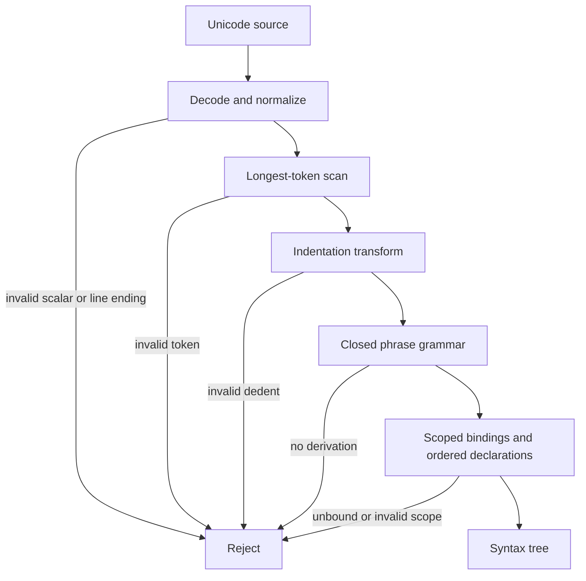

# Language syntax

## Formal text

### TOPAL-SYN-SOURCE-001 — Source decoding

A source file shall be Unicode text decoded without replacement characters.
The first Unicode scalar may be `U+FEFF` and is then discarded. Any other byte
decoding failure, embedded `U+0000`, isolated surrogate, or noncharacter is a
lexical error. Line endings `LF` and `CRLF` normalize to `LF`; bare `CR` is an
error. Tabs are forbidden in indentation. This realizes
`TOPAL-REQ-TOOLS-001`.

### TOPAL-SYN-UNICODE-001 — Revisioned Unicode semantics

The initial `design-0` language context shall use Unicode 17.0.0 for every
Unicode-derived semantic operation, including normalization, identifier
properties, character segmentation, and case operations. A conforming tool
shall use the data for that exact version and shall expose the selected version
in build metadata. Any generated artifact which records a language context
shall also record its Unicode version.

Changing the Unicode version creates a distinct revisioned language context.
A tool shall diagnose an unsupported Unicode context rather than substitute
host, dependency, or newer Unicode data. Mixed-script and confusable-name
diagnostics shall not change lexical acceptance or program semantics.

### TOPAL-SYN-CONTEXT-001 — Source language selection

Every source file shall begin, after an optional hashbang, comments, and blank
lines, with `use language ( version is V, features is F )`, where `features`
may be omitted when empty, line breaks are permitted by the ordinary product
grammar, `V` is a `Version` literal, and `F` is a finite collection of feature
identities. A tool shall preserve the selected feature identities in the
constructed language context. The stable
`design-0` context is identified by `v0.1`, canonically `v0.1.0-0`. A source
tool shall use that selection for the file even when its command line selected
a different interactive default, and shall diagnose unsupported versions.

An interactive source session may select its initial language version through
a tool option. When no version is supplied, every source tool shall select the
highest language version that tool implements. This default does not override
the mandatory selection in a source file.

A domain-specific language variant shall be constructed through `features`,
not through a second bootstrap grammar. A debugger command file shall select
`debug`; interactive debugger prompt evaluation selects that feature
implicitly. Selection adds only the variant's vocabulary and authority to that
source context.

### TOPAL-SYN-LIBRARY-001 — Explicit library dependency

After its initial language selection, a source file MAY declare a library
dependency with `use library N ( version is V )`, where `N` is a library
identity and `V` is a `Version` literal. The declaration SHALL NOT contain a
filesystem location or grant runtime authority. Duplicate declarations of one
identity or unsupported declaration fields SHALL be diagnosed.

The `std` root namespace SHALL be unavailable unless that source context
declares `use library std`. A source tool SHALL resolve the declared identity
and compatible version through its configured library resolver before it
evaluates a reference to the library. An unavailable library, unsupported
version, or reference to an undeclared library namespace SHALL be diagnosed.

### TOPAL-SYN-LEX-001 — Tokens

Let `printable` contain every assigned Unicode 17.0.0 scalar whose General
Category is not Control, Format, Private Use, Unassigned, Space Separator, Line
Separator, or Paragraph Separator and which does not have the
Default_Ignorable_Code_Point property. Let `structural` contain `"`, `#`, `(`,
`)`, `{`, `}`, `[`, `]`, and `,`. Let `identifier-character` be a `printable`
scalar which is not `structural`.

```ebnf
identifier       ::= identifier-start identifier-character* ;
version          ::= "v" natural "." natural [ "." natural [ "-" natural ] ] ;
identifier-start ::= identifier-character - Unicode-decimal-digit ;
discard          ::= "_" ;
boolean          ::= "true" | "false" ;
symbol           ::= "(" | ")" | "[" | "]" | "{" | "}" | ","
                   | ":" | "." | "=" | "!" | "!=" | "<" | ">" | "<=" | ">="
                   | "<=>" | "->" | ".." | "..."
                   | "+" | "-" | "*" | "/" | "/%" | "%" | "^" | "@" ;
newline          ::= "\n" ;
comment          ::= "# " { any-scalar-except-newline } ;
```

An identifier shall be in Unicode Normalization Form C. A spelling beginning
with `v` followed by a Unicode decimal digit shall not be an identifier. When
the digit is ASCII, the spelling begins a `version`; other decimal digits are
rejected because version and numeric literal digits are ASCII.
The complete spelling `_` is always `discard`, never an identifier. Keywords
are recognized from an identifier token by grammar position.

A declared symbolic operator is selected only when its complete spelling is a
token delimited by whitespace, `structural`, or a source boundary. Otherwise
its characters participate in an identifier. Thus `left + right` contains the
operator `+`, whereas `left+right` is one identifier. The scanner selects the
longest declared symbolic operator among the complete-token candidates. A
quote gives `literal-tag` recognition precedence over identifier recognition.

The complete ASCII lexemes `true` and `false` are reserved `boolean` literals,
not identifiers. They cannot be bindings or be shadowed. A longer identifier
which contains either spelling remains an identifier.

When `-` is immediately followed by a numeric-literal body, the scanner emits
one signed numeric literal. With intervening whitespace it emits the callable
symbol `-`. `+Infinity` and `-Infinity` are reserved numeric constants; no
other leading plus forms part of a literal.

Comments begin only with `# ` and extend to but exclude the newline. A `#`
without the separating space is rejected rather than beginning a comment.
Comment text has no syntactic effect. Blank and comment-only lines do not
affect indentation.

### TOPAL-SYN-INDENT-001 — Layout

After every newline, compare the count of leading spaces on the next nonblank
line with a stack initialized to `[0]`. A larger count emits `INDENT` and pushes
the count. An equal count emits nothing. A smaller count emits `DEDENT` until
the top equals the count; absence of an equal stack entry is an indentation
error. End of file emits a newline if needed and enough `DEDENT` tokens to
return to zero. Layout is ignored inside paired `()`, `[]`, and `{}`.

### TOPAL-SYN-NUM-001 — Numeric literals

```ebnf
decimal-integer ::= "0" | nonzero digit* | grouped-decimal ;
grouped-decimal ::= nonzero digit{0,2} ( "_" digit{3} )+ ;
based-integer   ::= ( "0b" bindigits | "0o" octdigits | "0x" hexdigits ) ;
rational        ::= decimal-integer "." fractional exponent?
                  | decimal-integer exponent ;
signed-number   ::= "-" ( decimal-integer | based-integer | rational ) ;
fractional      ::= digit+ | digit{3} ( "_" digit{3} )* ( "_" digit{1,2} )? ;
exponent        ::= ( "e" | "E" ) ( "+" | "-" )? decimal-integer ;
```

`bindigits`, `octdigits`, and `hexdigits` are either ungrouped valid digits or
groups of four separated at every boundary, with an initial group of one to
four digits. Unsigned integer literals denote exact nonnegative `Int` values;
signed integer literals denote their exact additive inverse. Fractional and
exponent forms denote the exact rational represented by their decimal
expansion, with an adjacent sign included before reduction. A lexeme matching
no complete production is rejected rather than split into adjacent numeric
tokens.

### TOPAL-SYN-STRING-001 — String literals

```ebnf
string        ::= '"' { any-scalar } '"'
                | literal-tag '"' { any-scalar } '"' literal-tag ;
literal-tag   ::= tag-character+ ;
```

The two `literal-tag` occurrences shall be the same nonempty NFC Unicode
sequence. A tag character is an `identifier-character`; unlike an identifier,
a tag may begin with a Unicode decimal digit. In the empty-tag form, the next `"`
closes the literal. In the tagged form, only the exact sequence `"` followed by
the opening tag closes it; other quotes belong to the contents.

Contents preserve their exact Unicode scalar sequence, including newlines,
backslashes, braces, and canonically equivalent spellings. String literals have
no escape processing and no interpolation. Formatting placeholders and doubled
braces are interpreted only by an explicit later `format` application, not by
literal construction. An absent matching closing delimiter is a recoverable
syntax error and the incomplete token extends to end of source.

### TOPAL-SYN-GRAMMAR-001 — Phrase grammar

The following grammar is closed: a token sequence not derivable from `source`
is invalid in revision `design-0`.

```ebnf
source        ::= separator* statement ( separator+ statement )* separator* EOF ;
separator     ::= NEWLINE ;
statement     ::= publication? declaration
                | expression
                | decision
                | diagnostic-control ;
publication  ::= "pub" ;
declaration  ::= pattern "is" expression
                | identifier "is" function
                | identifier "is" type-construction
                | identifier "is" interface
                | identifier "is" task ;
function     ::= "fn" static? input "->" output contract* suite ;
static       ::= "static" ;
input        ::= pattern | "(" [ field ( "," field )* ] ")" ;
output       ::= classifier ;
contract     ::= ( "uses" | "effects" | "ensures" ) expression ;
suite        ::= NEWLINE INDENT statement ( separator+ statement )* DEDENT ;
field        ::= pattern [ ":" classifier ] ;
classifier   ::= application ;
expression   ::= decision | application | product | block ;
application  ::= primary primary* ;
primary      ::= identifier | discard | literal | product | block
               | type-construction | callable-symbol ;
callable-symbol ::= "+" | "-" | "*" | "/" | "^" | "=" | "!="
                  | "<" | ">" | "<=" | ">=" ;
product      ::= "(" [ positional-fields | labeled-fields ] ")" ;
positional-fields ::= expression ( "," expression )* [ "," ] ;
labeled-fields ::= labeled-field ( "," labeled-field )* [ "," ] ;
labeled-field ::= identifier "is" expression ;
block        ::= "{" [ statement ( separator+ statement )* ] "}" ;
decision     ::= expression NEWLINE INDENT case+ DEDENT ;
case         ::= pattern [ "if" expression ] "then" expression separator* ;
pattern      ::= discard | identifier | literal
               | identifier pattern
               | "(" [ pattern-field ( "," pattern-field )* [ "," ] ] ")" ;
pattern-field ::= [ identifier "is" ] pattern [ ":" classifier ]
                | "..." ;
literal      ::= boolean | decimal-integer | based-integer | rational | signed-number
               | string ;
type-construction ::= expression "type" suite ;
interface    ::= "interface" suite ;
task         ::= "task" suite ;
diagnostic-control ::= "lang" warning-control identifier
                     | "lang" diagnostic-operation diagnostic-identity ;
warning-control ::= "disable-warning" | "push-disable-warning" | "pop-disable-warning" ;
diagnostic-operation ::= "disable-diagnostic"
                       | "push-disable-diagnostic" | "pop-disable-diagnostic" ;
diagnostic-identity ::= "(" identifier identifier+ ")" ;
```

`...` may occur only once and only as the final field of a structural record
pattern. A product with zero fields is `Unit`; a one-field parenthesized form is
grouping unless its field is labeled or followed by a comma. Application groups
left-to-right and has no operator-specific or user-defined precedence;
`a + b * c` groups as `(a + b) * c`. Newline terminates a statement
unless delimiters are open or the grammar requires a following suite.

A product shall not mix positional and labeled fields. The forms may be nested
explicitly when both structures are required.

When semantic checking establishes that the accumulated left value is a
record, the next identifier primary is its static field label rather than a
separate value operand. Selection therefore uses `record label`, groups before
the remaining ordinary application, and is rejected when the label is absent.

### TOPAL-SYN-BIND-001 — Binding and discard

A binding occurrence introduces its identifier only within the scope specified
by its enclosing declaration, pattern branch, or suite. Every repeated binding
in one pattern denotes one identity and must match equal objects. Each `_`
accepts exactly one required position, introduces no identity, and cannot be
referenced. An unbound identifier is a static name-resolution error.

`name : Classifier is expression` is a classified binding; the classifier is
part of the binding's immediate context. `name is expression` remains an
unclassified binding, and `_` cannot carry a classifier in this form.

### TOPAL-SYN-ORDER-001 — Declaration and overload order

Declarations enter a lexical scope in source order. Overloads with one name are
tested in that order after namespace selection and any explicit `Prefer`
resource. Expected result type, conversion quality, and capability strength do
not reorder candidates. The first applicable declaration is selected; absence
of one is a static error.

### TOPAL-SYN-DIAG-001 — Diagnostic control

`disable-diagnostic D` applies the structured diagnostic identity `D` to the
next complete statement in the same lexical context, independent of the
diagnostic's configured severity. `push-disable-diagnostic D` pushes `D`;
`pop-disable-diagnostic D` requires the identical namespace path at the top.
The warning-specific operations have the same behavior for their single legacy
warning identifier. Underflow, mismatch, a missing following statement, or a
nonempty stack at the context boundary is an error. Suppression changes neither
program semantics nor evidence trust status, and shall not suppress a language
error merely because a tool can assign that error a diagnostic identity.

## Graphical presentation



## Explanatory notes

The grammar fixes parsing, not static validity. Construction, classification,
capability matching, effects, and protocol legality are defined by the other
specifications. Context-selected language features may add productions only
when their revisioned feature specification names insertion points and remains
unambiguous with this grammar; absent features add no reserved vocabulary.

Foreign declarations, arbitrary operator declarations, exception syntax, and
general macros are deliberately outside `design-0`. Implementations must reject
them rather than guess their meaning. The exact token spellings of design ideas
still described as provisional are likewise unavailable until added by a later
revision.
