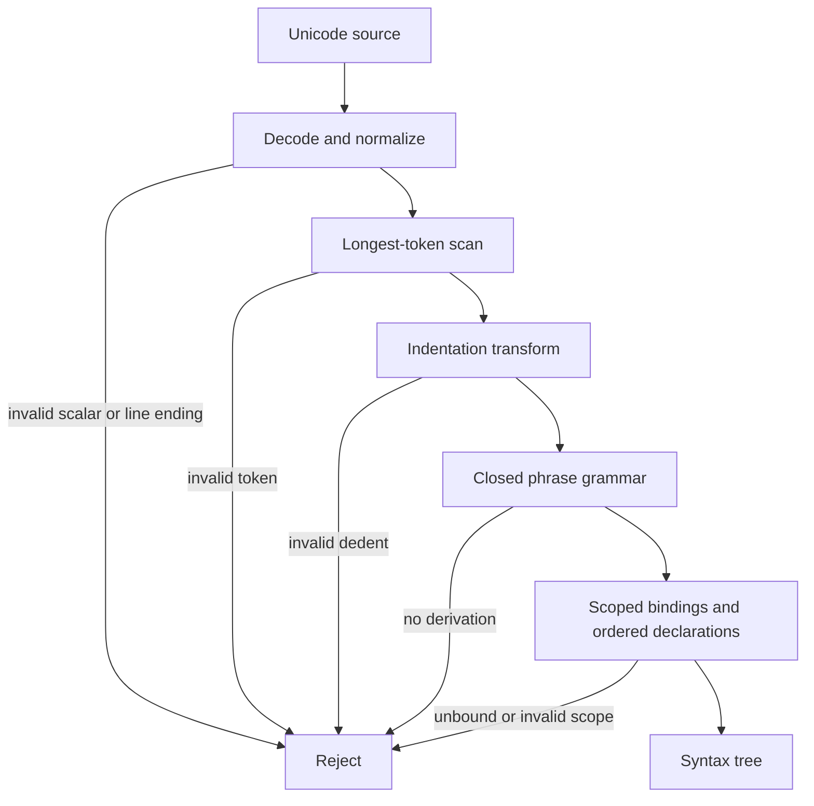

# Language syntax

## Formal text

### TOPAL-SYN-SOURCE-001 — Source decoding

A source file shall be Unicode text decoded without replacement characters.
The first Unicode scalar may be `U+FEFF` and is then discarded. Any other byte
decoding failure, embedded `U+0000`, isolated surrogate, or noncharacter is a
lexical error. Line endings `LF` and `CRLF` normalize to `LF`; bare `CR` is an
error. Tabs are forbidden in indentation. This realizes
`TOPAL-REQ-TOOLS-001`.

### TOPAL-SYN-UNICODE-001 — Revisioned Unicode semantics

The initial `design-0` language context shall use Unicode 17.0.0 for every
Unicode-derived semantic operation, including normalization, identifier
properties, character segmentation, and case operations. A conforming tool
shall use the data for that exact version and shall expose the selected version
in build metadata. Any generated artifact which records a language context
shall also record its Unicode version.

Changing the Unicode version creates a distinct revisioned language context.
A tool shall diagnose an unsupported Unicode context rather than substitute
host, dependency, or newer Unicode data. Mixed-script and confusable-name
diagnostics shall not change lexical acceptance or program semantics.

### TOPAL-SYN-LEX-001 — Tokens

Let `XID_Start` and `XID_Continue` be the Unicode 17.0.0 identifier properties
fixed by `TOPAL-SYN-UNICODE-001`.

```ebnf
identifier       ::= identifier-start identifier-continue* ;
identifier-start ::= XID_Start | "_" ;
identifier-continue ::= XID_Continue | "-" ;
discard          ::= "_" ;
symbol           ::= "(" | ")" | "[" | "]" | "{" | "}" | ","
                   | ":" | "." | "=" | "->" | "..."
                   | "+" | "-" | "*" | "/" | "^" ;
newline          ::= "\n" ;
comment          ::= "#" { any-scalar-except-newline } ;
```

`_` is always `discard`, never an identifier. A hyphen is permitted only
between identifier continuation characters; leading, trailing, and repeated
hyphens are invalid. Keywords are recognized from an identifier token by the
grammar position. The scanner selects the longest declared symbol. No other
punctuation run forms a token.

When `-` is immediately followed by a numeric-literal body, the scanner emits
one signed numeric literal. With intervening whitespace it emits the callable
symbol `-`. `+Infinity` and `-Infinity` are reserved numeric constants; no
other leading plus forms part of a literal.

Comments extend to but exclude the newline. Comment text has no syntactic
effect. Blank and comment-only lines do not affect indentation.

### TOPAL-SYN-INDENT-001 — Layout

After every newline, compare the count of leading spaces on the next nonblank
line with a stack initialized to `[0]`. A larger count emits `INDENT` and pushes
the count. An equal count emits nothing. A smaller count emits `DEDENT` until
the top equals the count; absence of an equal stack entry is an indentation
error. End of file emits a newline if needed and enough `DEDENT` tokens to
return to zero. Layout is ignored inside paired `()`, `[]`, and `{}`.

### TOPAL-SYN-NUM-001 — Numeric literals

```ebnf
decimal-integer ::= "0" | nonzero digit* | grouped-decimal ;
grouped-decimal ::= nonzero digit{0,2} ( "_" digit{3} )+ ;
based-integer   ::= ( "0b" bindigits | "0o" octdigits | "0x" hexdigits ) ;
rational        ::= decimal-integer "." fractional exponent?
                  | decimal-integer exponent ;
signed-number   ::= "-" ( decimal-integer | based-integer | rational ) ;
fractional      ::= digit+ | digit{3} ( "_" digit{3} )* ( "_" digit{1,2} )? ;
exponent        ::= ( "e" | "E" ) ( "+" | "-" )? decimal-integer ;
```

`bindigits`, `octdigits`, and `hexdigits` are either ungrouped valid digits or
groups of four separated at every boundary, with an initial group of one to
four digits. Unsigned integer literals denote exact nonnegative `Int` values;
signed integer literals denote their exact additive inverse. Fractional and
exponent forms denote the exact rational represented by their decimal
expansion, with an adjacent sign included before reduction. A lexeme matching
no complete production is rejected rather than split into adjacent numeric
tokens.

### TOPAL-SYN-STRING-001 — String literals

```ebnf
string        ::= '"' { any-scalar } '"'
                | literal-tag '"' { any-scalar } '"' literal-tag ;
literal-tag   ::= tag-character+ ;
```

The two `literal-tag` occurrences shall be the same nonempty NFC Unicode
sequence. A tag character is any scalar except `"`, whitespace, or the
structural delimiters `()`, `{}`, and `[]`. In the empty-tag form, the next `"`
closes the literal. In the tagged form, only the exact sequence `"` followed by
the opening tag closes it; other quotes belong to the contents.

Contents preserve their exact Unicode scalar sequence, including newlines,
backslashes, braces, and canonically equivalent spellings. String literals have
no escape processing and no interpolation. Formatting placeholders and doubled
braces are interpreted only by an explicit later `format` application, not by
literal construction. An absent matching closing delimiter is a recoverable
syntax error and the incomplete token extends to end of source.

### TOPAL-SYN-GRAMMAR-001 — Phrase grammar

The following grammar is closed: a token sequence not derivable from `source`
is invalid in revision `design-0`.

```ebnf
source        ::= separator* statement ( separator+ statement )* separator* EOF ;
separator     ::= NEWLINE ;
statement     ::= publication? declaration
                | expression
                | decision
                | diagnostic-control ;
publication  ::= "pub" ;
declaration  ::= pattern "is" expression
                | identifier "is" function
                | identifier "is" type-construction
                | identifier "is" interface
                | identifier "is" task ;
function     ::= "fn" static? input "->" output contract* suite ;
static       ::= "static" ;
input        ::= pattern | "(" [ field ( "," field )* ] ")" ;
output       ::= classifier ;
contract     ::= ( "uses" | "effects" | "ensures" ) expression ;
suite        ::= NEWLINE INDENT statement ( separator+ statement )* DEDENT ;
field        ::= pattern [ ":" classifier ] ;
classifier   ::= application ;
expression   ::= decision | application | product | block ;
application  ::= primary primary* ;
primary      ::= identifier | discard | literal | product | block
               | qualified | type-construction | callable-symbol ;
callable-symbol ::= "+" | "-" | "*" | "/" | "^" ;
qualified    ::= primary "." identifier ;
product      ::= "(" [ field-value ( "," field-value )* [ "," ] ] ")" ;
field-value  ::= [ identifier "is" ] expression ;
block        ::= "{" [ statement ( separator+ statement )* ] "}" ;
decision     ::= expression NEWLINE INDENT case+ DEDENT ;
case         ::= pattern [ "if" expression ] "then" expression separator* ;
pattern      ::= discard | identifier | literal
               | identifier pattern
               | "(" [ pattern-field ( "," pattern-field )* [ "," ] ] ")" ;
pattern-field ::= [ identifier "is" ] pattern [ ":" classifier ]
                | "..." ;
literal      ::= decimal-integer | based-integer | rational | signed-number
               | string ;
type-construction ::= expression "type" suite ;
interface    ::= "interface" suite ;
task         ::= "task" suite ;
diagnostic-control ::= "lang" ( "disable-warning"
                     | "push-disable-warning" | "pop-disable-warning" ) identifier ;
```

`...` may occur only once and only as the final field of a structural record
pattern. A product with zero fields is `Unit`; a one-field parenthesized form is
grouping unless its field is labeled or followed by a comma. Application groups
left-to-right and has no operator-specific or user-defined precedence;
`a + b * c` groups as `(a + b) * c`. Newline terminates a statement
unless delimiters are open or the grammar requires a following suite.

### TOPAL-SYN-BIND-001 — Binding and discard

A binding occurrence introduces its identifier only within the scope specified
by its enclosing declaration, pattern branch, or suite. Every repeated binding
in one pattern denotes one identity and must match equal objects. Each `_`
accepts exactly one required position, introduces no identity, and cannot be
referenced. An unbound identifier is a static name-resolution error.

### TOPAL-SYN-ORDER-001 — Declaration and overload order

Declarations enter a lexical scope in source order. Overloads with one name are
tested in that order after namespace selection and any explicit `Prefer`
resource. Expected result type, conversion quality, and capability strength do
not reorder candidates. The first applicable declaration is selected; absence
of one is a static error.

### TOPAL-SYN-DIAG-001 — Diagnostic control

`disable-warning W` applies to the next complete statement in the same lexical
context. `push-disable-warning W` pushes `W`; `pop-disable-warning W` requires
`W` at the top. Underflow, mismatch, or a nonempty stack at the context boundary
is an error. Suppression changes neither semantics nor evidence trust status.

## Graphical presentation



## Explanatory notes

The grammar fixes parsing, not static validity. Construction, classification,
capability matching, effects, and protocol legality are defined by the other
specifications. Context-selected language features may add productions only
when their revisioned feature specification names insertion points and remains
unambiguous with this grammar; absent features add no reserved vocabulary.

Foreign declarations, arbitrary operator declarations, exception syntax, and
general macros are deliberately outside `design-0`. Implementations must reject
them rather than guess their meaning. The exact token spellings of design ideas
still described as provisional are likewise unavailable until added by a later
revision.
