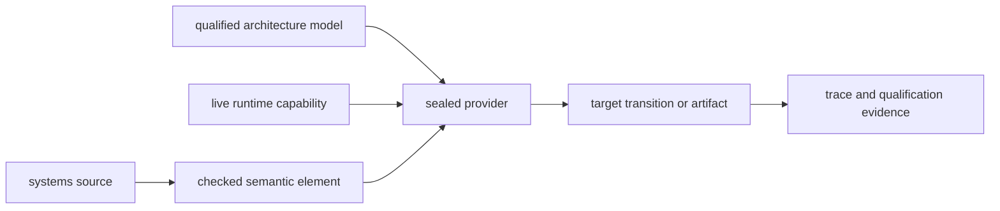

# Freestanding systems-profile semantics

## Formal text

### TOPAL-SYSTEMS-FEATURE-001 — Feature and artifact boundary

`systems` SHALL be a revisioned language feature selected through
`TOPAL-SYN-CONTEXT-001`. It SHALL add the sealed `lang systems` namespace and
SHALL add no grammar production. A source context selecting it SHALL be valid
only within one qualified freestanding systems root artifact. The same root
SHALL NOT use an ordinary hosted-process artifact profile.

A dependency which does not select `systems` SHALL retain its portable
semantics and vocabulary when composed into a systems artifact. Selection,
import, name lookup, or architecture-model access SHALL NOT itself grant
runtime authority.

### TOPAL-SYSTEMS-AUTHORITY-001 — Unforgeable systems authority

An entry, processor, privilege, address-space, mapping, interrupt, preemption,
fault-recovery, device, DMA, context, placement, or artifact capability SHALL
be an opaque resource identity constructed only by a qualified artifact or
provider transition. Ordinary or generated source SHALL NOT construct, copy,
widen, serialize, deserialize, compare for underlying identity, or derive such
authority from a numeric value, model fact, layout, or diagnostic projection.

Every systems operation SHALL consume or borrow the exact live capability for
its subject and SHALL record its effects, context, lifetime, failure, and
provider evidence. A target model SHALL establish legality facts only and
SHALL NOT satisfy runtime authority.

### TOPAL-SYSTEMS-VOCABULARY-001 — Initial sealed root construction

The initial systems source profile SHALL use ordinary application, function,
product, and binding syntax under the sealed `lang systems` namespace. A root
SHALL construct exactly one `lang systems artifact` whose `bootstrap-storage`
member is one `lang systems bounded-bootstrap-storage`, whose `bootstrap`
member is one `lang systems bootstrap-entry`, and whose `debug-break` member is
one `lang systems synchronous-exception-entry`, and whose
`local-notification` member is one `lang systems external-interrupt-entry`.
It SHALL also contain exactly one `deadline-notification` member constructed as
one `lang systems external-interrupt-entry`.
It SHALL also contain exactly one `kernel-thread` member constructed as one
`lang systems resumed-thread-entry`.
The storage constructor SHALL
contain exactly positive `capacity-bytes` and `alignment-bytes` natural-number
fields. Alignment SHALL be a power of two and SHALL NOT exceed capacity. The
bootstrap entry SHALL have one handler from `BootstrapContext` to
`BootstrapDisposition`; the debug-break entry SHALL have one handler from
`DebugBreakContext` to `DebugBreakDisposition`; and the local-notification
entry SHALL have one handler from `LocalNotificationInterruptContext` to
`LocalNotificationInterruptDisposition`; and the deadline-notification entry
SHALL have one handler from `DeadlineInterruptContext InitialMonotonicClock` to
`DeadlineInterruptDisposition InitialMonotonicClock`; and the kernel-thread
entry SHALL have one handler accepting `KernelThreadContext InitialProcessor`
and `SuspendedKernelContext InitialProcessor` and producing
`KernelThreadDisposition InitialProcessor`.

The only admitted initial handler operations SHALL be context-qualified
`console write`, `debug break`, local-notification completion,
deadline-notification completion, kernel-context terminal retirement, `resume`,
and `fatal`. Console write SHALL
borrow the live board console capability and this increment SHALL accept only a
static text value. Debug break SHALL borrow the bootstrap context and declare
one synchronous debug-break observation. Resume SHALL consume one live
completed entry context and resume exactly its interrupted continuation. Fatal
SHALL consume its live entry context and SHALL NOT return.

Every handler SHALL end in one disposition admitted by its context. The
context SHALL occur only as the receiver of an admitted operation, SHALL be
consumed exactly once by the final disposition, and SHALL NOT be rebound,
captured, stored, passed, returned, or used after consumption. Unknown
namespace members, extra artifact entries, mismatched handler classifiers,
duplicate roots, and ordinary-source use of any systems classifier or member
SHALL be rejected before lowering.

The bounded bootstrap pool SHALL be monotonic and SHALL NOT acquire a host
service. Each allocation request SHALL name a positive byte count, a
power-of-two alignment no greater than the pool alignment, and a closed
semantic placement. It SHALL return either one affine `BootstrapRegion` or one
sealed `BootstrapStorageErrorCode`: `invalid-request` for a malformed or
phase-invalid request and `exhausted` when aligned capacity is insufficient.
Releasing a region SHALL consume it without making its bytes available for a
later bootstrap allocation. Bootstrap completion SHALL require no live region
and SHALL make the complete pool reclaimable. No source operation SHALL expose
the model offset as a machine or physical address.

A live `BootstrapRegion` SHALL admit plain byte store and load only while
borrowed by its originating bootstrap execution. An access SHALL use a
zero-based offset strictly below the region byte count; a stored value SHALL be
a `Nat` no greater than 255, and a load SHALL return such a `Nat`. The initial
executable slice SHALL accept only statically known requests and offsets whose
alignment, capacity, value range, and bounds are proven before lowering.
Dynamic access SHALL remain unavailable until it carries a proof or an
explicitly specified failure result. It SHALL NOT be unchecked.

Allocation SHALL use the ordinary exhaustive `Result` decision, with an affine
region bound only in the `Ok` action and a sealed storage error bound only in
the `Error` action. Every reachable success action SHALL release its region
exactly once before the bootstrap context is consumed. Load and store SHALL
borrow rather than consume the region; release SHALL consume it. A region SHALL
NOT escape through return, storage, capture, message, task, foreign,
serialization, another entry, or an allocation-error action.

Plain region access SHALL NOT acquire volatile, atomic, device, DMA, firmware,
or user-memory semantics. Those domains SHALL require their separately typed
protocols. A provider MAY choose a target-specific concrete location and
instruction sequence only when it preserves the region's bounds, byte
contents, ownership, lifetime, and failure behavior without exposing its
address or allocation metadata to source.

The first semantic target profile SHALL record target
`x86_64-unknown-none`, board `topal-qemu-pc-q35-10.2`, and profile
`topal.systems.x86_64-qemu-pc-q35-10.2/1`. Executable qualification SHALL apply
only to the closed operation, provider, artifact, option, board, and physical-
evidence set recorded for that profile. Any unqualified extension SHALL fail
before producing an artifact.

### TOPAL-SYSTEMS-ENTRY-001 — Static special entry

`SystemEntry K` SHALL classify a static artifact declaration rather than an
ordinary callable function. `K` SHALL be one of `Bootstrap`, `SecondaryCpu`,
`SynchronousException`, `ExternalInterrupt`, `UserSyscall`,
`MachineCritical`, or `ResumeThread` in the initial profile.

An entry declaration SHALL identify one target profile, handler, opaque
context classifier, legal capability bundle, execution restrictions, and
closed disposition set. The context and capabilities SHALL be affine, SHALL
exist only for the dynamic entry extent, and SHALL NOT escape through return,
storage, capture, message, task, foreign, serialization, or another entry.

The backend SHALL own physical entry symbols, sections, alignment, machine
frames, stack transitions, saved state, security transitions, unwind/debug
information, and return sequences. Source SHALL NOT select or observe those
representations.

### TOPAL-SYSTEMS-DISPOSITION-001 — Complete entry disposition

An entry handler SHALL end in exactly one disposition admitted by its entry
kind. A disposition SHALL name the semantic continuation, such as resume,
return to validated user state, schedule, deliver a user exception, or fatal
transition. It SHALL consume the entry context and every outstanding affine
entry obligation.

The checker SHALL reject a disposition unless required interrupt
acknowledgement, masking/preemption restoration or transfer, address-space and
user-state validation, resource release/transfer, and recovery obligations are
proved. A disposition SHALL NOT be represented as an ordinary function return
in checked semantics.

### TOPAL-SYSTEMS-OBSERVATION-001 — Declared observation and linearization

A systems external observation SHALL have event
`Observe(s,q,p)`, where `s` is one live source capability, `q` is that source's
monotonic event identity, and `p` is a value or declared error satisfying its
selected layout. Its contract SHALL state ordering, duplication, loss,
acknowledgement, and completion rules.

A concurrent protocol MAY expose `Linearize(d,t)` for transition `t` in domain
`d` when several invariant-preserving transitions are enabled without an
ordering edge. Every permitted linearization SHALL preserve the protocol
invariant and external contract. The resulting events SHALL participate in the
observable trace and replay evidence.

Absent `Observe` or `Linearize` input/effects, systems code SHALL retain the
portable schedule-equivalence requirement. These events SHALL NOT authorize a
data race, arbitrary random choice, invented event, or removal, duplication,
merging, or speculation of a required observation.

### TOPAL-SYSTEMS-LOCAL-INTERRUPT-001 — Local-notification interrupt lifecycle

`local notification send` SHALL consume one admitted processor context and
produce one affine pending session with source identity `s`, the source's next
monotonic event identity `q`, and the exact prior local maskable-interrupt
state. The consumed context SHALL be invalid until the matching wait completes.
A second send, ordinary use of the consumed context, escape, duplication, or
ordinary completion while the session is live SHALL be rejected.

`local notification wait` SHALL consume that pending session. Successful wait
completion SHALL require, in order, `Observe(s,q)`, entry through the declared
local-notification external-interrupt entry, consumption of its completion
obligation, resumption of the interrupted continuation, and restoration of the
recorded prior maskable-interrupt state. Another event SHALL NOT satisfy the
wait. The provider MAY temporarily change local mask state inside the sealed
wait transition but source SHALL NOT observe or retain that state.

The external entry SHALL receive one affine
`LocalNotificationInterruptContext(s,q)`. `local notification complete` SHALL
consume it and produce one completed context admitting only the declared
resume or fatal disposition. Resume before completion, completion outside the
matching entry, duplicate completion, context escape, or ordinary return SHALL
be rejected. Completion SHALL discharge the target acknowledgement or pending-
state obligation; a zero-instruction completion SHALL require target evidence
that the complete obligation is otherwise satisfied.

The initial profile SHALL admit exactly one local-notification handler and one
send/wait event. It SHALL make no timer, bounded-latency, fairness, nested-entry,
SMP-delivery, shared-device-routing, or scheduler-disposition guarantee.

### TOPAL-SYSTEMS-MONOTONIC-CLOCK-001 — Monotonic-clock observation

The initial systems profile SHALL provide one opaque provider-created
`Clock InitialMonotonicClock` borrowed through each admitted processor context.
`monotonic clock now` SHALL borrow that context and clock and SHALL return one
immutable `Instant InitialMonotonicClock`. Neither authority SHALL be consumed
or widened by observation.

For clock identity `c`, its next observation identity `q`, and provider value
`t`, a successful observation SHALL record
`Observe(c,q,Instant(c,t))`. Observation identities SHALL increase in source
order. An accepted value SHALL be greater than or equal to the preceding value
accepted from `c`; equality SHALL be permitted. A decreasing value SHALL fail
closed and SHALL NOT be clamped, replaced, or exposed as an accepted instant.

Instants SHALL retain exact clock identity and SHALL NOT compare, subtract, or
substitute across clocks. The provider SHALL own counter selection, scale,
resolution, enablement, access, wrap extension, regression detection, and the
target state required for monotonicity. Source SHALL NOT observe a counter
address, register, instruction, width, frequency, calibration mechanism, or
wrap state. The compiler SHALL NOT invent, predict, merge, duplicate, remove,
or speculate a required clock observation.

The initial executable slice SHALL admit exactly two observations after its
local-notification wait and before its time-success marker. It SHALL make no
wall-clock, periodic-release, sleep, timeout,
bounded-latency, rate-accuracy, SMP, suspend, migration, userspace-ABI, or
real-time guarantee.

### TOPAL-SYSTEMS-DEADLINE-EVENT-001 — One-shot deadline event

Constructing `Deadline c` from `Instant c` and an exact positive `Duration`
SHALL preserve the absolute same-clock instant and SHALL fail on range
overflow. It SHALL NOT observe the clock. A deadline from another clock SHALL
NOT substitute, arm, or satisfy the event.

`deadline notification arm` SHALL borrow one admitted processor context,
consume one deadline, and produce one affine `ArmedDeadline c` with one new
monotonic event identity `q`. The deadline, armed event, and temporarily
consumed context SHALL NOT be duplicated, escaped, or used by another event.
`deadline notification wait` SHALL consume the armed event and return the
processor context only after the matching observation, typed entry, consuming
completion, and resumption have occurred.

Delivery SHALL record `DeadlineEvent(c,q,scheduled,observed)`, where scheduled
is the deadline's instant and observed is one newly accepted `Instant c`.
Observed SHALL be greater than or equal to scheduled. Late delivery SHALL
retain both values. If the deadline is already expired when armed, the event
SHALL become immediately deliverable against the original scheduled instant;
the provider SHALL NOT restart the relative duration.

The entry SHALL receive one affine `DeadlineInterruptContext(c,q,scheduled,
observed)`. `deadline notification complete` SHALL consume that context and
produce one completed context admitting only resume or fatal disposition.
Resume before completion, completion outside the matching entry, duplicate
completion, an early observation, or ordinary completion with a live deadline
authority SHALL be rejected.

The initial executable slice SHALL admit exactly one deadline constructed from
the second qualified monotonic observation and `1[ms]`, one arm/wait lifecycle,
and one declared handler. Comparator, timer, route, vector, controller,
acknowledgement, wait, frame, and return representation SHALL remain private to
the provider. Cancellation, rearming, periodic release, scheduler integration,
multiple outstanding events, bounded latency, rate accuracy, SMP delivery,
suspend/migration guarantees, and userspace timer ABI SHALL remain unavailable.

### TOPAL-SYSTEMS-MACHINE-001 — Closed machine-provider transition

A machine-provider operation SHALL have a stable closed identity and specify:
consumed and produced semantic state; privilege and resource identities;
legal execution contexts; fault and recovery behavior; ordering and visibility
relations; required architecture evidence; and an abstract model transition or
explicit unavailable-model result.

Only a language revision SHALL introduce a common machine-operation identity.
A common identity SHALL have one architecture-independent contract. A facility
without that contract SHALL use a target-qualified identity. No provider or
source package SHALL introduce an arbitrary instruction, register, clobber,
intrinsic, or opaque privileged transition.

### TOPAL-SYSTEMS-ADDRESS-001 — Disjoint address families

Systems address families SHALL include `Physical`, `KernelVirtual`,
`UserVirtual A`, `Device D`, `Dma I`, and `Firmware F`, each qualified by its
owning resource identity where shown. Numeric equality across families or
owners SHALL establish neither aliasing nor authority.

An address range SHALL record a target-qualified width and half-open
mathematical-natural interval whose endpoint calculation does not overflow
that width. Checked subrange and offset derivation SHALL preserve family,
owner, bounds, and no stronger authority. Decoding an external number SHALL
produce only an untrusted candidate until validated against one live range.
There SHALL be no general integer-to-address or cross-family cast.

### TOPAL-SYSTEMS-BOOT-MEMORY-001 — Affine boot-memory refinement

`describe memory` SHALL consume exactly one entered bootstrap context and its
opaque provider-private handoff. It SHALL be handled through an exhaustive
`Result` decision. The `Ok` action SHALL bind one `MemoryDescribedContext`; the
`Error` action SHALL bind one `BootMemoryFailureContext` which admits only a
fatal disposition. The consumed entered context SHALL be invalid on both
paths, and neither result context SHALL escape its entry extent.

A successful provider SHALL produce disjoint, nonempty, nonwrapping,
page-qualified `Physical` ranges classified as `Allocatable`, `Reclaimable`,
`Persistent`, `Reserved`, `Unusable`, or `Unknown`. Each range SHALL retain its
source classification and provider provenance. An unknown classification
SHALL NOT be allocatable. Overlapping claims SHALL be split and resolved so
that any non-allocatable claim prevents allocation and `Unusable` dominates.
Incomplete page-edge fragments SHALL remain reserved.

Before an `Allocatable` capability is produced, the provider SHALL subtract
every live bootstrap reservation, including applicable adapter, transition,
stack, kernel-image, bootstrap-storage, handoff, command-line, initramfs, and
firmware ranges. Each reservation SHALL retain an owner and reclamation
condition. Portable source SHALL NOT inspect a native handoff record, derive a
numeric physical address, or regain the entered context.

Malformed, overflowing, cyclic, contradictory, unsupported, or allocation-
empty input SHALL select the failure action. A provider SHALL NOT approximate
such input with host memory, fabricated RAM, or an unchecked range.

### TOPAL-SYSTEMS-FRAMES-001 — Affine physical-frame allocation

`create frame allocator` SHALL consume exactly one memory-described bootstrap
context through an exhaustive `Result` decision. Its `Ok` action SHALL bind one
`FrameAllocatorContext` retaining the preceding bootstrap capabilities and
exclusively owning the normalized allocatable-frame authority. Its `Error`
action SHALL bind one `FrameAllocatorFailureContext` which admits only a fatal
disposition. The consumed context SHALL be invalid on both paths, and neither
result context SHALL escape its entry extent.

An allocation SHALL borrow one live allocator and request a nonzero frame count
and power-of-two alignment in target-profile base-frame units. Success SHALL
produce one affine `PhysicalFrameExtent` carrying allocator identity, extent
identity, count, alignment, and provider provenance. Its base SHALL remain
opaque. The extent SHALL grant neither byte access nor mapping, device, DMA,
firmware, or user-memory authority. Malformed or exhausted allocation SHALL
select an explicit failure without invalidating the allocator.

Live extents SHALL NOT overlap each other, non-allocatable ranges, or retained
reservations. `release` SHALL consume an extent into exactly its originating
allocator. Cross-allocator release, double release, use after release, extent
escape, and a bootstrap disposition with a live extent SHALL be invalid.
Allocation choice and coalescing MAY vary only when success, failure, alignment,
non-overlap, ownership, and provenance observations remain equivalent.

### TOPAL-SYSTEMS-MAPPING-001 — Linear mapping state

A location SHALL combine one live address range with layout, rights, lifetime,
supported access sizes/alignment, cache policy, and ordering domain. A mapping
SHALL be a linear resource relating source and destination ranges under page
layout, permissions, owner, lifetime, and translation-provider evidence.

Page-table editing SHALL require one exclusive builder. Activation,
permission change, unmapping, translation invalidation, and reuse SHALL follow
one declared state protocol and SHALL name every affected processor/scope.
Storage or address reuse SHALL be invalid until the provider's completion
contract establishes that no stale translation can authorize access.

`kernel map` SHALL borrow one live frame-allocator context and consume one
affine `PhysicalFrameExtent`. Success SHALL produce one affine
`KernelMapping` recording opaque source and provider-selected kernel-virtual
extents, rights, execution policy, memory kind, owner, lifetime, and provider
evidence without exposing either numeric base. Failure SHALL admit only the
declared context-preserving failure action or a consuming disposition; it
SHALL NOT duplicate or silently release the extent.

A live read-write, non-executable normal-memory mapping MAY authorize bounded
plain byte load and store. Such access SHALL NOT imply physical, user, device,
DMA, firmware, volatile, atomic, or executable authority. Writable execution,
out-of-bounds access, wrong-provider use, frame release while mapped, mapping
escape, use after unmap, and a disposition with a live mapping SHALL be
invalid.

`kernel unmap` SHALL consume the mapping, revoke its access authority, satisfy
the provider completion contract, and return exactly the original opaque frame
extent. Physical storage reuse SHALL remain invalid until this transition
completes. A provider MAY adopt a pre-existing sealed translation only when it
proves the same rights, lifetime, inaccessibility-after-unmap, and reuse
observations as a constructed translation.

Bootstrap translation replacement SHALL begin by borrowing one live allocator
and consuming provider-selected backing authority into one exclusive affine
`TranslationUpdate`. The initial request SHALL be exactly template
`bootstrap-equivalent` with page policy `provider-selected`. The update SHALL
retain a snapshot of the current qualified bootstrap coverage and access
observations without exposing backing addresses, table levels, entries, or
target state.

`translation commit` SHALL consume one live validated update into one inactive
affine `TranslationSpace`. `translation activate` SHALL consume that inactive
space and the current translation authority, perform the provider-required
publication, synchronization, activation, and completion relations, and
produce a refined bootstrap context owning the new active space. On activation
success, subsequent operations SHALL use only the refined context. On an
indeterminate activation result, the initial slice SHALL admit only fatal
termination.

The replacement SHALL preserve the existing bootstrap coverage and permissions
and SHALL NOT add user authority, widen access, or make physical and virtual
families interchangeable. Duplicate or escaped updates, use after commit,
activation before commit, wrong-provider activation, backing release while
owned by an update or space, reuse of the prior translation by ordinary source,
and disposition with a live inactive update or space SHALL be rejected before
lowering or fail closed.

An active translation edit SHALL consume one active context into one exclusive
affine `TranslationEdit`. While the edit is live, the prior context SHALL admit
no operation or disposition. The initial map request SHALL be exactly normal,
read-write, non-executable kernel memory with placement `provider-selected`.
Map SHALL consume one live frame extent into one provisional opaque
`KernelMapping`; that mapping SHALL admit no access before commit.

`translation commit` SHALL consume the edit, validate the complete candidate
state, publish the provider-private translation changes, perform the required
ordering and invalidation completion relations, and return a refined active
context. Commit failure with indeterminate target visibility SHALL admit only
fatal termination. On success, the provisional mapping SHALL become live and
bounded by its consumed extent.

Unmap in an exclusive edit SHALL consume the live mapping into a provisional
returned extent. That extent SHALL NOT be accessed, released, or remapped until
commit has removed the translation and completed the required invalidation
scope. After successful commit, the old mapping SHALL be unusable and the
returned extent SHALL regain ordinary frame ownership. Abandonment, duplicate
edit or mapping authority, access before map commit, access after unmap,
release before unmap commit, nested or concurrent edits, wrong-space commit,
and disposition with a live edit SHALL be rejected before lowering or fail
closed.

Source SHALL NOT observe or select a virtual address, granule, table level,
entry, address-space identifier, invalidation address, processor mask,
register, or instruction. The initial slice SHALL admit one live dynamic
mapping and SHALL leave user mappings, device memory, permission changes,
executable mappings, remote-processor shootdown, and provider-metadata
reclamation unsupported.

### TOPAL-SYSTEMS-RECOVERY-001 — Closed fault recovery and user transfer

A recovery scope SHALL name a finite fault class, admitted generated
operations, resource identities, result mapping, and cleanup. The backend
SHALL bind only generated fault sites in that scope to generated recovery
continuations. Source SHALL NOT observe, construct, or supply a faulting or
recovery instruction address.

A user transfer SHALL require one live `UserVirtual A` validation capability,
untrusted candidate range and maximum extent, direction, layout or byte policy,
kernel-owned storage, and partial-progress/interruption policy. It SHALL return
validated data, permitted partial progress, or a structured fault. Direct
source access through a user candidate SHALL be invalid.

An unlisted fault, nested fault outside its own admitted scope,
machine-critical event, or corrupted entry/stack state SHALL NOT be caught by
this rule and SHALL follow its owning entry or fatal protocol.

### TOPAL-SYSTEMS-ATOMIC-001 — Atomic location and modification order

`AtomicLocation T D` SHALL be a live, aligned fixed-layout location for one
provider-supported scalar or tagged state `T` in synchronization domain `D`.
Its construction SHALL consume exclusive storage ownership; its destruction
SHALL prove that no atomic operation remains before returning storage to
non-atomic use or release.

For each atomic location `l`, all successful modifications SHALL have one
strict total modification order `mo_l` consistent with happens-before. Atomic
load, store, exchange, compare/exchange, and admitted read-modify-write SHALL
be indivisible and a read SHALL observe one value permitted by `mo_l` and the
operation's order. An atomic operation SHALL have an effect on `l` and `D`.

Plain conflicting access to live atomic storage SHALL be invalid. Atomicity
SHALL NOT grant access to overlapping storage, repair an invalid lifetime, or
imply device/DMA atomicity.

For the initial `atomic word` form, construction SHALL consume one live
ordinary region and select one naturally aligned provider-width unsigned word
wholly contained at the requested byte offset. The only admitted domain SHALL
be `cpu-shared`. The whole region SHALL remain unavailable for plain access or
release while the atomic location is live. `atomic end` SHALL consume the
location only when no operation remains in flight, retain its final word
contents, and return the same region identity and extent to plain ownership.

Initial compare/exchange SHALL return `Exchanged previous` exactly when the
observed value equals `expected`; that successful transition SHALL replace the
value with `desired` at one point in `mo_l`. Otherwise it SHALL return
`Observed actual` without modifying `l`. The source result SHALL be exhaustive,
and every ordinary continuation SHALL end the location before region release.
Source SHALL NOT observe a machine address, provider word spelling, register,
instruction, exclusive-monitor state, or retry attempt.

### TOPAL-SYSTEMS-ORDER-001 — Atomic and visibility relations

Atomic orders SHALL be:

- `AtomicOnly`: `mo_l` participation without an unrelated visibility edge;
- `Acquire`: `AtomicOnly` plus an edge from an observed release sequence to
  observations sequenced after the acquire;
- `Release`: `AtomicOnly` plus an edge from observations sequenced before it to
  an acquire which observes its release sequence;
- `AcquireRelease`: both relations for a modifying operation; and
- `Sequential`: `AcquireRelease` plus one strict total order over all
  sequential operations consistent with happens-before and each `mo_l`.

Compare/exchange SHALL declare success and failure orders separately; a
failure order SHALL be `AtomicOnly` or `Acquire`. A provider MAY strengthen an
implementation order but SHALL NOT expose a result forbidden by the selected
order.

The initial atomic-word increment SHALL admit `AcquireRelease` success and
`Acquire` failure for compare/exchange and `Acquire` for the following load.
These orders apply only to CPU-shared normal memory. Target implementations MAY
use one locked instruction, an architectural atomic extension, or a qualified
exclusive-reservation loop provided the observable result and progress
contract are preserved.

CPU memory, device/MMIO, DMA ownership, cache maintenance, instruction
synchronization, and translation maintenance SHALL be distinct relation
families. Each operation SHALL name direction, observations, agents, topology
scope, and completion. A zero-instruction lowering SHALL require evidence that
the target already guarantees the complete relation.

### TOPAL-SYSTEMS-CRITICAL-001 — Affine critical-state restoration

Entering a preemption or interrupt critical scope SHALL produce one affine
token containing processor identity, domain, nesting identity, and exact prior
state. The token SHALL be consumed exactly once by the matching restoration or
an admitted disposition transfer on every exit path. It SHALL NOT escape,
suspend, cross a processor, or be restored out of nesting order.

For the initial `local-maskable-interrupts` domain, `critical enter` SHALL
consume the current execution context and produce a context refined to that
domain plus opaque restoration authority for the exact immediately preceding
state. `critical restore` SHALL consume that refined context and authority and
produce the preceding context. A nested entry, where supported, SHALL allocate
a distinct nesting identity, and restoration SHALL consume identities in
last-in-first-out order. Completion, disposition, suspension, blocking, and
processor transfer with a live critical context SHALL be rejected.

Target interrupt flags, registers, controller masks, and instructions SHALL
NOT be source-observable values. A provider SHALL restore exactly the state
captured by the matching entry; it SHALL NOT unconditionally enable a domain
which was disabled before entry.

The exclusion established by a critical scope SHALL contain only the producers
named by its domain. Masking local interrupts SHALL NOT establish exclusion
from another processor, non-maskable event, device, or DMA agent. An operation
which may block SHALL be invalid in interrupt or machine-critical context.

### TOPAL-SYSTEMS-CONTEXT-001 — Linear execution-context transfer

A suspended execution context SHALL be an opaque linear resource owning its
kernel stack, saved target state, extended-state policy, thread identity, and
address-space relationship. It SHALL arise only from special entry,
initial-context construction, or prior qualified transfer.

Context transfer SHALL consume the running-context capability and exactly one
validated suspended context, perform its declared per-processor and
address-space transition, and resume exactly one continuation. It SHALL be
nonordinary control flow and SHALL NOT expose register slots, stack pointers,
or continuation instruction addresses to source. User/debug state SHALL use a
separate validated semantic view.

The initial executable slice SHALL construct exactly one
`SuspendedKernelContext InitialProcessor` by borrowing the admitted running
context and consuming one 16 KiB, 16-byte-aligned, bootstrap-reclaimable
ordinary region plus the static `kernel-thread` entry. Construction SHALL NOT
run the entry. The suspended context SHALL retain the originating pool,
region, processor, thread, address-space, entry, and extended-state-policy
identities without exposing their target representation.

The initial `kernel context transfer` SHALL consume the bootstrap running
context and that suspended context, suspend the caller at one typed
continuation, retain the active address-space identity, and resume the worker
on `InitialProcessor`. Local maskable interrupts SHALL be disabled at the
transfer boundary. The worker entry SHALL receive its running context and the
affine suspended caller.

`kernel context retire to caller` SHALL be a terminal worker disposition. It
SHALL be legal only with no live region, mapping, frame, atomic, critical,
interrupt, recovery, or cleanup obligation. It SHALL consume the worker and
suspended caller, mark the worker terminal, and resume exactly that caller.
The caller SHALL receive one affine `CompletedKernelContextTransfer
InitialProcessor` owning its restored running authority and the retired
worker's stack. `kernel context reclaim` SHALL consume that completion, return
the stack region to its originating monotonic pool, and produce the resumed
caller context. Use after transfer, duplicate transfer, wrong-processor or
wrong-entry use, retirement with a live obligation, ordinary worker return,
and disposition with a live suspended or completed context SHALL be rejected.

This slice SHALL NOT admit involuntary preemption, scheduler policy, run
queues, priority, timeslicing, blocking, general yield, arbitrary cancellation,
multiple threads, migration, SMP, address-space switching, user contexts,
floating-point or vector ownership, TLS/per-CPU switching, stack growth, or
unwinding across transfer. X86-64, AArch64, and RISC-V register and frame sets
SHALL remain provider evidence rather than portable source meaning.

### TOPAL-SYSTEMS-CONTEXT-002 — Cooperative context handoff

A qualified cooperative transfer SHALL consume one running context and one
matching suspended target. If the old continuation is later resumed, it SHALL
receive exactly one affine outcome which restores its running authority and
either returns the peer as suspended or owns the peer as terminal until
reclamation. An outcome SHALL retain provider, processor, address-space,
context, stack, entry, and continuation identities. Source SHALL NOT copy,
forge, widen, or reinterpret an outcome.

A closed entry protocol MAY statically refine the outcome when the checker can
prove whether that selected continuation hands off or retires. A mismatch
between the declared result classifier and the selected entry protocol SHALL
be rejected. `kernel context retire to target` SHALL consume the running
context and one matching suspended target at a transfer-safe point, mark the
running context terminal, and resume exactly the target with a
`CompletedKernelContextTransfer InitialProcessor`. Reclamation SHALL consume
the completion and return the retired stack to its originating pool.

The initial cooperative slice SHALL construct exactly two suspended contexts
from disjoint 16 KiB, 16-byte-aligned, bootstrap-reclaimable regions. Its
checked source order SHALL be cooperative-worker transfer and suspended
handoff, terminal-worker transfer and retirement/reclamation, cooperative-
worker resumption and retirement/reclamation, then bootstrap disposition with
no live context. The cooperative worker SHALL hand off exactly once before
retirement; the terminal worker SHALL retire on first entry. Target reuse,
wrong order, overlapping stack ownership, wrong result refinement, retirement
with a live obligation, and disposition with a live or unreclaimed context
SHALL be rejected.

Runnable selection SHALL remain source policy. The provider SHALL NOT own a
run queue or select the next context. This slice SHALL retain one processor,
one active address space, and disabled local maskable interrupts and SHALL NOT
admit involuntary preemption, blocking, dynamic run queues, priority,
timeslicing, cancellation, migration, SMP, user contexts, floating-point or
vector ownership, TLS/per-CPU switching, stack growth, guard pages, or
cross-transfer unwinding.

### TOPAL-SYSTEMS-DEVICE-001 — Register protocol access

A device location SHALL bind its layout to one live device session, permitted
access directions and widths, alignment, read/write side effects, reserved-bit
policy, ordering domain, and failure behavior. An access SHALL be an observable
effect and SHALL occur exactly as required by its protocol: it SHALL NOT be
invented, removed, duplicated, combined, or moved across a conflicting event.

Target-specific addressed-I/O facilities SHALL satisfy the same resource,
effect, context, and lifetime rules even when they are not MMIO. Knowledge of
an address or port number SHALL grant no session or access capability.

### TOPAL-SYSTEMS-DMA-001 — DMA ownership protocol

A DMA buffer SHALL have exactly one of `CpuOwned`, `Prepared`, `DeviceOwned`,
`Completed`, `Failed`, or terminal reclaimed states. A transition SHALL name
direction, device and translation domains, mapping, cache/visibility work,
descriptor publication, notification, completion source, and failure/cleanup.

CPU access SHALL be invalid while ownership is `DeviceOwned`, except for an
explicitly modeled coherent shared protocol. Device notification SHALL require
completed preparation and descriptor visibility. Unmapping or reclamation
SHALL require completed/cancelled device ownership and every provider-specific
completion obligation. A coherent provider MAY perform no cache instruction
only with evidence preserving these same transitions.

### TOPAL-SYSTEMS-STORAGE-001 — Allocation and semantic placement

A systems allocation SHALL be fallible and SHALL name one live pool/region,
alignment, address family, context legality, reclaim policy, and physical/DMA
constraints. Bootstrap allocation SHALL remain within its bounded artifact-
provided resource. No allocation or cleanup path SHALL acquire a host service
implicitly.

An ordinary kernel-owned region SHALL support bounds-checked plain byte load
and store while borrowed. Release SHALL consume the region, after which no
access is valid. Region access SHALL expose neither a machine address nor
provider allocation metadata and SHALL NOT be used for volatile, atomic,
device, DMA, firmware, or user memory.

Static placement SHALL use closed semantic requirements, including special
entry text, read-only or mutable data, per-processor template,
bootstrap-reclaimable data, page-aligned table, and boot-adapter input. Source
SHALL NOT name an object section, linker directive, or physical register. The
artifact provider SHALL prove that its concrete placement satisfies every
requirement.

### TOPAL-SYSTEMS-ARTIFACT-001 — Validated freestanding publication

A systems artifact SHALL record a distinct target profile, architecture model,
provider revisions, data layout, object format, relocation/code model, entry
set, placement plan, link inputs, debug/unwind identity, and provenance. It
SHALL contain no implicit host syscall, allocator, process startup, libc,
dynamic loader, foreign runtime, or ordinary process-termination path.

Linking and structural inspection SHALL complete before atomic publication of
the kernel, debug, map, and provenance outputs. Boot packaging SHALL be a
separately qualified adapter which records its boot/firmware contract and input
artifact digest. A fatal disposition SHALL enter a nonreturning provider whose
minimal path requires no general allocation, blocking lock, scheduler,
filesystem, or userspace service.

### TOPAL-SYSTEMS-QUALIFY-001 — Qualification and fail-closed support

Each systems element SHALL have semantic, context, authority, lifetime,
ordering, target, and unsupported-provider tests; an abstract model transition
or explicit model limitation; artifact inspection where lowering is physical;
and emulator or hardware evidence for each executable-qualified provider.

A common element SHALL be reviewed against x86-64, AArch64, and RISC-V before
admission. This review SHALL NOT executable-qualify those targets. A compiler,
interpreter, or provider missing applicable qualification SHALL reject the
feature, operation, target, or artifact before producing partial output and
SHALL NOT substitute a host mechanism.

## Graphical presentation

## Explanatory notes

The systems profile exposes machine interaction without making representation
the source model. A target may use an instruction sequence, runtime table,
generated entry stub, or no instruction at all when each refines the same
semantic transition.

Atomic and external-observation rules extend the execution relation only in a
selected systems context. They do not weaken ordinary Topal race rejection or
permit an optimizer to choose an application-visible interleaving.
