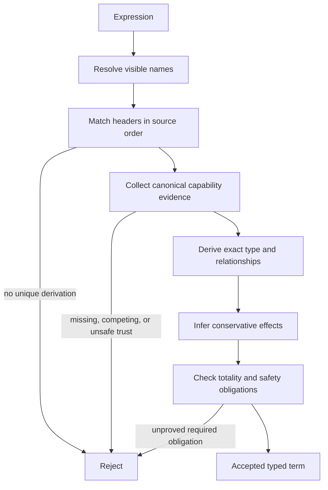

# Type system

## Formal text

### TOPAL-TYPE-KIND-001 — Object kinds

Every static object has exactly one kind in:

`{Value, Type, Function, Predicate, Constraint, Capability, Interface, Pattern,
Effect, Protocol, Scope, Module}`.

`Predicate <: Function`; no other distinct kinds are subkinds. A kind mismatch
is a static error. Types classify values; functions transform objects;
constraints refine values of one base type; capabilities attach verified or
explicitly trusted semantic evidence to existing objects. Types and functions
are never interchangeable. This realizes `TOPAL-REQ-MODEL-001`.

### TOPAL-TYPE-JUDGE-001 — Typing judgment

The primary judgment is `Γ; Κ ⊢ e : T ! ε ▷ φ`, where `Γ` maps names to exact
objects, `Κ` contains canonical capability evidence, `T` is the result type,
`ε` is the conservative effect set, and `φ` is retained relationship evidence.
An implementation shall accept `e` only if one unique derivation exists after
ordered overload selection. Accepted derivations preserve `T`, `ε`, and `φ`.

### TOPAL-TYPE-ID-001 — Type identity

Two structural types are identical iff their constructors, ordered positional
components, labeled components, classifiers, constraints, and retained static
parameters are recursively identical. Two nominal types are identical iff they
originate from the same published declaration and have identical retained
parameters. Aliases preserve identity; new nominal constructions do not.
Visibility may hide structure but never changes identity.

### TOPAL-TYPE-PRODUCT-001 — Products, records, sums, and enums

`Tuple(T₁…Tₙ)` classifies ordered values `(v₁…vₙ)` exactly when each `vᵢ:Tᵢ`.
The zero-field product `Tuple()` is `Unit` and classifies exactly the single
value `()`.
`Record{lᵢ:Tᵢ}` classifies a value containing each label exactly once. Label
order is declaration order and does not affect label lookup. A closed record
admits no additional field; an open record pattern may observe additional
visible fields but neither captures nor reconstructs them.

`Variant(T₁…Tₙ)` is positional and selects one member by index.
`Union{Cᵢ:Tᵢ}` carries exactly one labeled tag and payload. An enum is a nominal
union whose payloads are all `Unit`.

### TOPAL-TYPE-ENUM-001 — Nominal payload-free enum values

A declaration `Name is Enum ( A₁, …, Aₙ )` introduces one nominal enum type and
one complete value for each distinct alternative label. Display uses the label
alone. Two values of the same enum type provide canonical equality and compare
equal exactly when their alternatives are identical; values from different
enum declarations do not share an equality operation merely because labels
match. The type and every alternative name are immutable in their declaration
scope.

A declared enum name is a value classifier for its own alternatives. Function
argument and result validation shall accept exactly values carrying that enum's
nominal identity; alternatives of another enum remain outside the classifier
even when a label has the same spelling in a different lexical scope.

### TOPAL-TYPE-BOOLEAN-001 — Boolean values

`Boolean` classifies exactly the two distinct values `true` and `false`. Neither
value implicitly converts to or from a numeric value. The reserved literal
`true` evaluates to the first value and `false` to the second without name
resolution.

### TOPAL-TYPE-BOOLEAN-LOGIC-001 — Eager logical application

The fixed Boolean applications are `not value`, `left and right`, `left or
right`, and `left xor right`. They accept only Boolean operands and never apply
numeric conversion. Every supplied operand evaluates exactly once from left to
right; `and` and `or` are not short-circuit control forms. Binary logical
applications group under `TOPAL-SYN-GRAMMAR-001`.

`not a` returns the opposite Boolean value. `a and b` is true exactly when both
operands are true. `a or b` is true exactly when at least one operand is true.
`a xor b` is true exactly when the operands differ.

### TOPAL-TYPE-OPTIONAL-CONSTRUCT-001 — Explicit Optional construction

`Optional T` is the nominal sum of payload alternative `Some T` and unit
alternative `None`. `Some value` evaluates `value` exactly once and infers
`Optional T` from its classifier `T`. `None T` explicitly constructs the absent
alternative of `Optional T`. The alternatives display as `Some value` and
`None`; the payload classifier remains part of nominal identity even though it
is omitted from the absent value's display.

### TOPAL-TYPE-OPTIONAL-CONTEXT-001 — Contextual absent construction

Bare `None` constructs the absent alternative only when an immediate expected
classifier supplies `Optional T`. The constructed value retains that `T` as its
nominal payload classifier. Without such context, bare `None` is not a universal
value and shall be rejected as unresolved.

The immediate expected classifier may come from a classified binding or an
ordinary function result, including an explicit `return None`. Both contexts
construct the same nominal absent value and emit the same conformance decision.

### TOPAL-TYPE-OPTIONAL-BOUNDARY-001 — Optional function boundaries

`Optional T` is a valid ordinary parameter and result classifier. A call accepts
exactly Optional values retaining the same nominal payload classifier `T`, and a
function result shall retain that identity unchanged. Sharing the displayed
alternative `None` does not make `Optional A` satisfy `Optional B`.

### TOPAL-TYPE-EQUALITY-001 — Equality application

If `T` provides canonical `Equality` evidence and `a:T`, `b:T`, then `a = b`
evaluates to `true` exactly when the two values are equal under that evidence,
and otherwise to `false`. `Unit`, `Boolean`, `Int`, `Rational`, and `String`
provide canonical equality; string equality compares the preserved Unicode
sequence. A tuple provides equality exactly when corresponding fields do, and
compares equal exactly when every corresponding field compares equal.
A record provides equality exactly when both operands have the same set of
labeled fields and values at corresponding labels provide equality; it compares
equal exactly when every corresponding field compares equal. Construction order
does not affect record type identity or equality. Records with different labeled
shapes have no shared equality overload.

Canonical conversion may make one equality overload applicable. In particular,
mixed `Int` and `Rational` equality applies `TOPAL-NUM-INT-RATIONAL-CONVERT-001`
once and then uses rational equality. Different types without such a conversion,
and tuples of different arity, have no applicable equality overload rather than
evaluating to `false`. Equality returns `Boolean` and performs no numeric
coercion of that result.

`a != b` has exactly the same applicability, conversions, and observations as
`a = b`, and returns the Boolean negation of that equality result. It is a
derived operation and does not introduce distinct inequality evidence.

### TOPAL-TYPE-ORDERING-001 — Total-order application

If `T` provides canonical `TotalOrder` evidence and `a:T`, `b:T`, their
three-way comparison produces exactly `Less`, `Equal`, or `Greater`, with
`Equal` agreeing with `TOPAL-TYPE-EQUALITY-001`. The predicates `<`, `>`, `<=`,
and `>=` select the corresponding result or result set and return `Boolean`.

`Tuple(T₁…Tₙ)` provides `TotalOrder` exactly when every `Tᵢ` provides it.
Tuple comparison is lexicographic from the first field and stops at the first
non-`Equal` result. Tuples of different arity have different types and no shared
tuple-ordering overload. Canonical field conversions may make the corresponding
field comparison applicable before the tuple result is selected.

### TOPAL-TYPE-CONSTRAINT-001 — Constraints

For base type `T` and total pure predicate `p:T→Boolean`, constraint `C=(T,p)`
classifies exactly `{v∈T | p(v)=true}`. Static construction with a statically
known `v` succeeds only when the compiler proves `p(v)`; otherwise it is a
static error. Dynamic validation returns `Result(C, Codes)` and yields reusable
evidence on success. Constraint evidence may be forgotten losslessly to `T`;
the reverse is validation, not conversion.

### TOPAL-TYPE-CAP-001 — Capability evidence

`Κ ⊢ o : C[e]` means object `o` satisfies capability `C` using evidence `e`.
For each canonical pair `(o,C)`, at most one evidence interpretation exists.
Evidence is admitted only when claimed by the definition context of `o` or `C`,
or derived by exactly one visible derivation. An explicit owner claim suppresses
derivation; competing derivations are an error. Import order cannot select
evidence.

Capability laws have trust state `verified`, `trusted-unverified`, or `refuted`.
Refuted evidence is rejected. Evidence required for memory safety, totality,
race freedom, or deadlock freedom shall be `verified`. Suppression cannot alter
trust state.

### TOPAL-TYPE-MATCH-001 — Header and pattern matching

A function header is a static pattern over its input object. Matching proceeds
left-to-right. A name first binds the complete matched object; recurrence of the
same name requires exact identity. `_` checks its position without binding.
Classifier chains refine left-to-right. A successful match makes all retained
relationships and visible evidence available to the body.

An open structural record pattern matches an anonymous record containing at
least the named visible fields. A nominal record matches only through an
explicitly published structural view. Hidden declarations never participate.

### TOPAL-TYPE-CALL-001 — Function application

If `Γ;Κ ⊢ f : Function(A→B, εf)`, `Γ;Κ ⊢ a:A ! εa`, and the first applicable
overload header matches `a`, then:

`Γ;Κ ⊢ f a : B[a] ! (εa ∪ εf[a]) ▷ φf[a]`.

Substitution retains dependent identities, constraints, sizes, versions,
states, and existential witnesses. An expected result may check the selected
result but never changes overload order.

### TOPAL-TYPE-CONVERT-001 — Conversions

Implicit conversion is permitted only for the single canonical conversion
declared lossless for an exact source and destination pair. At most one such
path may exist and implicit conversion never chains. Lossy, rounding,
saturating, validation, representation, and effectful transformations require
explicit functions. Conversion does not unify repeated pattern bindings.

### TOPAL-TYPE-EXIST-001 — Existential results

`exists X:K. T[X]` packages a witness `x:K` and value `v:T[x]`. Elimination
introduces a fresh rigid identity for `x`; it may be used through revealed
constraints but cannot escape a scope unless the result type repackages it.
Finite dynamic alternatives preserve a sum of exact implementation evidence;
erasure retains only common guarantees and the union of possible effects.

### TOPAL-TYPE-RESULT-001 — Explicit successful Result contract

`Result ( Value, Codes )` explicitly classifies either a successful `Value` or
a structured `Error` whose code belongs to `Codes`. In the initial executable
slice, `Codes` may be `lang arithmetic ArithmeticErrorCode`; an ordinary value
classified by `Value` satisfies the successful path without an additional
runtime wrapper. Declaring `Result` shall not construct an `Error` or choose its
compiler-derived domain.

When a fallible function returns an `Error` produced by another operation and
its declared code vocabulary contains that error's code type, propagation
preserves the complete Error unchanged, including domain, detail, cause, and
source provenance. Propagation shall be traceable separately from construction.

### TOPAL-ERROR-FIELD-001 — Structured Error observation

Selecting `code` from an `Error` returns the concrete namespace-defined
`ErrorCode` subtype value stored by the reporting operation. Selecting `domain`
returns the compiler-derived `ErrorDomain` identity stored independently in the
same Error. Selection shall not reconstruct or otherwise alter the Error, and
tools shall expose which field was selected.

### TOPAL-TYPE-RESULT-PROJECT-001 — Contextual success projection

When an expression classified as `Result ( T, Codes )` initializes a binding
whose explicit classifier requires `T`, success binds the value and failure
returns the complete Error immediately from the enclosing function. That
function shall itself permit the propagated code vocabulary. An unclassified
binding retains the complete Result and performs no projection; an infallible
or top-level context cannot propagate the Error.

### TOPAL-TYPE-TOTAL-001 — Totality and failure

Ordinary functions shall prove that every input reaches a value in finite
computation. Structural recursion must decrease verified well-founded evidence.
Potentially infinite production is admitted only as a productive generator in
which every request yields, ends, fails, closes, terminates, or suspends on a
declared external event in finite computation. Runtime failure is an explicit
`Error` in `Result(Value,Codes)`; exceptions are absent. This realizes
`TOPAL-REQ-TOTAL-001`.

### TOPAL-TYPE-SOUND-001 — Preservation and progress

For safe closed `e`, if `∅;Κ ⊢ e:T ! ε` and `e → e'`, then `∅;Κ ⊢ e':T ! ε'`
with `ε' ⊆ ε`. Either `e` is a value, is a declared external suspension, or a
unique permitted step exists. No permitted step produces an unclassified
value, undeclared effect, or undefined operation. Implementations may reject a
program when required proof is unavailable; they may not accept it by assuming
unverified safety evidence. This realizes `TOPAL-REQ-SAFE-001`.

## Graphical presentation

## Explanatory notes

The type system deliberately distinguishes value restrictions from semantic
promises: constraints select values, while capabilities provide evidence about
objects and operations. “First applicable overload” is deterministic even when
later declarations would be more specific.

This specification permits conservative rejection. That freedom does not allow
tools to disagree about the meaning of a program they accept: exact types,
retained relationships, effects, and selected declarations remain fixed.
Representation layout, serialized encoding, memory access, and task scheduling
are governed by their respective specifications and cannot be inferred from
type identity alone.
