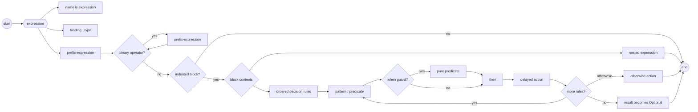
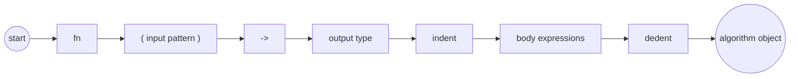

# Topal syntax sketch

This document records the provisional surface syntax for Topal. The syntax is
intended to make composition and dependencies visible while remaining easy to
parse. It describes design direction, not yet a stable language specification.

## Lexical structure

Source is encoded as text and divided into identifiers, literals, symbols,
newlines, and indentation. Spaces are required where adjacent tokens would
otherwise merge, and the formatter will use spaces around operators:

```topal
value + 2
left = right
```

Conventional single-character delimiters do not require surrounding spaces.
`(`, `)`, `[`, `]`, `{`, `}`, and `,` always remain individual structural
tokens; adjoining them does not invent a new token. These are equivalent before
formatting:

```topal
Point(10, 20)
Point ( 10 , 20 )
```

The canonical spelling is provisionally `Point ( 10 , 20 )`. Multi-character
symbols such as `->` must be declared by the language rather than formed from
arbitrary runs of punctuation.

Tabs are forbidden in indentation. Blank and comment-only lines do not affect
indentation. An unindent closes the current block.

## Expressions and application

An algorithm with one input uses prefix notation:

```topal
print "Hello"
Integer 10
static algorithm
```

An algorithm with two inputs uses infix notation. The left input is normally
the primary object being operated on, while the right input supplies the other
argument:

```topal
value + 2
text contains "error"
collection map transformation
```

Binary application associates from left to right and has no operator-specific
precedence:

```topal
a f b g c
```

means:

```topal
( a f b ) g c
```

Parentheses override this grouping. Indentation can supply a grouped expression
without accumulating closing parentheses:

```topal
a f
  b g c
```

means:

```topal
a f ( b g c )
```

Mixing familiar operators does not introduce hidden precedence. Code must group
the intended operation explicitly when left-to-right evaluation is not wanted.

## Products and construction

A comma constructs or separates components of a product inside delimiters:

```topal
( 10 , 20 )
```

Types and other constructors use ordinary prefix application:

```topal
point is Point ( 10 , 20 )
```

The same structural shape can be used as a pattern:

```topal
point
  Point ( x , y ) then x + y
```

Whether `Point ( x , y )` constructs or matches is determined by its expression
or matcher context. Its tokenization and grouping do not change.

## Bindings and classification

`is` introduces an immutable binding. It always binds the name on its left to
the object produced on its right:

```topal
limit is Integer 10
number-type is Integer
```

Because types are first-class objects, this distinction is significant:

```topal
text is String
```

binds `text` to the type object `String`. It does not declare a string value.

`:` classifies a value, binding, or pattern with the type expression on its
right:

```topal
text : String
index : Integer
```

The right operand of `:` is always a type. A constraint is applied first to
construct a refined type, after which `:` performs ordinary classification.

## Constraints and refined types

A constraint is a first-class object applicable to a particular type. Applying
it directly to its base type constructs a refined type; no `constrained-by`
keyword is needed:

```topal
CamelCase is constraint String
  verification-body

name : CamelCase String
```

The kinds are conceptually:

```topal
String             : Type
CamelCase          : Constraint String
CamelCase String   : Type
```

Constraint application follows the same prefix syntax as every other unary
construction. The kind checker verifies that the constraint accepts the supplied
base type. Static values are checked during compilation; dynamic values require
validation and produce evidence on success.

Constraints compose into predicates and refined types:

```topal
index : ( >= 0 and < length ) Integer
```

The exact preferred ordering for composite constraints remains provisional. The
essential rule is that the complete expression to the right of `:` must have
kind `Type`, not merely `Constraint`.

## Algorithm definitions

`fn` is a prefix constructor for an algorithm object. A definition binds that
object using `is`:

```topal
strlen is fn ( text : String ) -> Integer
  body
```

The input is a pattern, `->` separates it from the output type, and the indented
block is the body. Multiple inputs are represented as a product pattern:

```topal
minimum is fn ( left : Integer , right : Integer ) -> Integer
  left
    < right then left
    otherwise right
```

Errors are ordinary result values rather than exceptions. Effects complement
the input and result types, but their surface syntax has not yet been selected.

## Predicates and partial application

A binary relation can be fully applied:

```topal
2 < 5
```

Omitting its left operand constructs a predicate section:

```topal
< 5
```

This is equivalent to an algorithm awaiting a subject:

```topal
value -> value < 5
```

There is only one definition of `<`; section syntax derives its unary predicate
form. `and` and `or` combine predicates about the same subject:

```topal
> 2 and < 5
= 0 or = 10
```

`and` and `or` have equal precedence and group left to right. Mixing them should
use explicit grouping; the compiler may require it to avoid conventional
precedence assumptions:

```topal
( > 2 and < 5 ) or = 10
```

## Decision tables

An expression followed by an indented list of rules supplies the subject for
each rule:

```topal
checked-value
  > 5 then print "Too high"
  < 2 then print "Too low"
  otherwise print "Just right"
```

Rules are considered from top to bottom. The first matching rule is selected,
and only its action runs. Guards must be pure and total; actions may have effects.
`then` structurally separates a matcher from its delayed action, so it does not
participate in operator precedence.

A complete table returns the common action result type. An incomplete table
returns an optional result:

```topal
value
  > 5 then calculate value
```

has type `Optional Result`, while adding `otherwise` makes its type `Result`.
Ignoring an optional result may produce a warning when it appears accidental.

Successful decisions refine the active constraints. For example, the selected
branch below carries evidence that the index is in bounds:

```topal
index
  >= 0 and < collection length then collection get index
  otherwise return error OutOfBounds
```

## Patterns and matchers

Patterns use the same ordered decision-table form:

```topal
result
  Ok value then return value
  Error problem then report problem
```

A successful pattern may introduce bindings and evidence. These are available
only in its action. Patterns and predicates share a general matcher abstraction,
so `and` and `or` have one meaning: combine compatible matchers over the same
subject.

Both alternatives of `or` must expose compatible bindings:

```topal
response
  Timeout reason or Disconnected reason then retry reason
```

When alternatives bind different names or types, separate rules are used.

`when` adds a pure predicate after structural matching, when names introduced by
the pattern are available:

```topal
person
  Person ( name , age ) when age >= 18 then greet name
  otherwise return error Ineligible
```

Total algorithms require exhaustive patterns. A non-exhaustive decision used as
an expression instead receives the optional result type described above.

## Provisional grammar

This EBNF describes grouping, not all kind and arity checks:

```ebnf
file              = { line } ;
line              = expression [ block ] newline ;
block             = indent { line } dedent ;

expression        = binding | classification | binary-chain ;
binding           = identifier "is" expression ;
classification    = bindable ":" type-expression ;

binary-chain      = prefix-expression
                    { binary-operator prefix-expression } ;
prefix-expression = { prefix-operator } primary ;
primary           = identifier | literal | product | grouped ;
grouped           = "(" expression ")" ;
product           = "(" expression "," expression
                    { "," expression } ")" ;

function          = "fn" input-pattern "->" type-expression block ;
decision          = expression decision-block ;
decision-block    = indent rule { rule } dedent ;
rule              = matcher "then" expression [ block ] newline
                  | "otherwise" expression [ block ] newline ;
matcher           = pattern [ "when" predicate ] ;
predicate         = predicate-term { ( "and" | "or" ) predicate-term } ;
```

Identifiers such as `fn`, `is`, `then`, `when`, and `otherwise` are structural
in the shown positions. Algorithm arity and object kinds are checked after the
source has been grouped; they must not change that grouping.

## Grammar diagram

Mermaid does not currently provide native railroad diagrams. The following
left-to-right flowchart uses railroad-style paths to show the principal grammar.



Algorithm construction is a specialized prefix expression with an attached
body:


