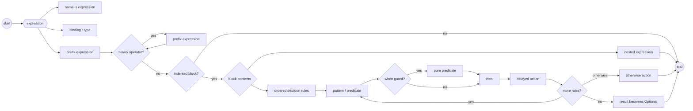
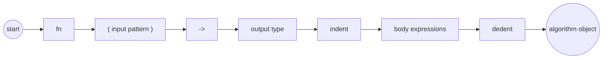

# Topal syntax sketch

This document records the provisional surface syntax for Topal. The syntax is
intended to make composition and dependencies visible while remaining easy to
parse. It describes design direction, not yet a stable language specification.

## Lexical structure

Source is encoded as text and divided into identifiers, literals, symbols,
newlines, and indentation. Spaces are required where adjacent tokens would
otherwise merge, and the formatter will use spaces around operators:

```topal
value + 2
left = right
```

Conventional single-character delimiters do not require surrounding spaces.
`(`, `)`, `[`, `]`, `{`, `}`, and `,` always remain individual structural
tokens; adjoining them does not invent a new token. These are equivalent before
formatting:

```topal
Point(10, 20)
Point ( 10 , 20 )
```

The canonical spelling is provisionally `Point ( 10 , 20 )`. Multi-character
symbols such as `->` must be declared by the language rather than formed from
arbitrary runs of punctuation.

Tabs are forbidden in indentation. Blank and comment-only lines do not affect
indentation. An unindent closes the current block.

`#` followed by a space begins a comment. The comment continues through the
remainder of the line and ends at the newline:

```topal
# A whole-line comment.
value is Integer 10 # An end-of-line comment.
```

The separating space is required: `#comment` does not begin a comment. The
`# ` form is part of the stable bootstrap syntax used to read a source file's
[language selection](modules.md#the-language-module) before applying its
selected grammar.

## Expressions and application

An algorithm with one input uses prefix notation:

```topal
print "Hello"
Integer 10
static algorithm
```

An algorithm with two inputs uses infix notation. The left input is normally
the primary object being operated on, while the right input supplies the other
argument:

```topal
value + 2
text contains "error"
collection map transformation
```

An algorithm has zero, one, or two syntactic operands. A zero-operand call uses
the empty argument list so that invoking an algorithm remains distinct from
referring to it as a value:

```topal
current-time ()
```

Values beyond the two-operand limit must be packaged into one or both operands
explicitly. Parentheses make the extra structure visible: a comma-separated
positional argument list has no labels, while a map associates names with
values using `is`:

```topal
( source, fallback ) combine ( other, other-fallback )
( source is left, fallback is 0 ) combine (
  source is right,
  fallback is 0
)
```

The second form does not add four operands to `combine`; it supplies two map
operands, each containing two associations. Chaining another application
applies the result of the first application rather than adding a third operand.

Binary application associates from left to right and has no operator-specific
precedence:

```topal
a f b g c
```

means:

```topal
( a f b ) g c
```

Parentheses override this grouping. Indentation can supply a grouped expression
without accumulating closing parentheses:

```topal
a f
  b g c
```

means:

```topal
a f ( b g c )
```

Mixing familiar operators does not introduce hidden precedence. Code must group
the intended operation explicitly when left-to-right evaluation is not wanted.

## Products and construction

A comma constructs or separates components of a product inside delimiters:

```topal
( 10 , 20 )
```

Types and other constructors use ordinary prefix application:

```topal
point is Point ( 10 , 20 )
```

The same structural shape can be used as a pattern:

```topal
point
  Point ( x , y ) then x + y
```

Whether `Point ( x , y )` constructs or matches is determined by its expression
or matcher context. Its tokenization and grouping do not change.

## Bindings and classification

`is` introduces an immutable binding. Outside a map construction it binds the
name on its left to the object produced on its right:

```topal
limit is Integer 10
number-type is Integer
```

Because types are first-class objects, this distinction is significant:

```topal
text is String
```

binds `text` to the type object `String`. It does not declare a string value.

Inside a map construction, `is` associates the key on its left with the value
on its right. It remains a value association rather than a classification:

```topal
counts is Map ( String, Nat ) (
  "apple" is 2,
  "pear" is 3
)
```

An empty value is constructed by applying the fully specified map type to the
empty argument list. When a binding already provides the expected type, only
the value construction is needed:

```topal
empty-counts is Map ( String, Nat ) ()

other-counts : Map ( String, Nat )
other-counts is ()
```

`:` classifies a value, binding, or pattern with the type expression on its
right:

```topal
text : String
index : Integer
```

The right operand of `:` is always a type. A constraint is applied first to
construct a refined type, after which `:` performs ordinary classification.

## Constraints and refined types

A constraint is a first-class object applicable to a particular type. Applying
it directly to its base type constructs a refined type; no `constrained-by`
keyword is needed:

```topal
CamelCase is constraint String
  verification-body

name : CamelCase String
```

The kinds are conceptually:

```topal
String             : Type
CamelCase          : Constraint String
CamelCase String   : Type
```

Constraint application follows the same prefix syntax as every other unary
construction. The kind checker verifies that the constraint accepts the supplied
base type. Static values are checked during compilation; dynamic values require
validation and produce evidence on success.

Constraints compose into predicates and refined types:

```topal
index : ( >= 0 and < length ) Integer
```

The exact preferred ordering for composite constraints remains provisional. The
essential rule is that the complete expression to the right of `:` must have
kind `Type`, not merely `Constraint`.

### Constraints on type fields

A field's classification may use a refined type. Later fields may refer to
earlier fields in the same declaration, making relationships between components
part of the declared type:

```topal
pub Interval is type
  pub start : Integer
  pub end : ( > start ) Integer
```

Here `end` is an `Integer` constrained to be greater than the particular
`start` in the same `Interval`; the declaration describes a dependent product,
not two independently classified integers. The constraint evidence remains
attached to the value when its fields are projected or matched.

Dependencies follow declaration order. A field may refer only to fields
declared before it, so forward references and cyclic field constraints are
invalid. Constraints involving several fields can consequently be placed on a
later field once every value they need has been declared.

Constructing a value must establish every field constraint. Statically known
components are checked during compilation, and a violated constraint is a
compile-time error. When the components are dynamic and the relationship is not
already proven, construction performs validation and produces `Result Interval`
on success:

```topal
pub interval is fn (
  start : Integer,
  end : Integer
) -> Result Interval
  Interval ( start, end )
```

This field syntax states an invariant of every value of the declared type. A
separately applied constraint such as `Ordered Interval`, by contrast, creates
a refined type and does not make the constraint true of every plain `Interval`.

## Algorithm definitions

`fn` is a prefix constructor for an algorithm object. A definition binds that
object using `is`:

```topal
strlen is fn ( text : String ) -> Integer
  body
```

The input is a pattern, `->` separates it from the output type, and the indented
block is the body. `()` declares zero operands, a single pattern declares one,
and two components declare the left and right operands of an infix algorithm:

```topal
current-time is fn () -> Instant
  body

strlen is fn ( text : String ) -> Integer
  body

minimum is fn ( left : Integer , right : Integer ) -> Integer
  left
    < right then left
    otherwise right
```

A component may itself be a parenthesized positional argument list or a map.
Map entries are declared with `:` because the declaration classifies each name;
calls supply them with `is` because they associate names with values. An entry
may use `default` followed by its default value:

```topal
zip-longest-default-zero is fn (
  (
    list : List Nat,
    fallback : Nat default 0
  ),
  (
    list : List Nat,
    fallback : Nat default 0
  )
) -> List ( Nat, Nat )
  body
```

The two map operands have separate scopes, so corresponding entries may use the
same names. A call may omit the defaulted associations or override them:

```topal
( list is left ) zip-longest-default-zero ( list is right )

(
  list is left,
  fallback is 10
) zip-longest-default-zero (
  list is right,
  fallback is 20
)
```

Defaults fill omitted map associations; they do not remove an entire syntactic
operand or turn a binary function into a unary one. Unknown and duplicate
association names are errors.

The input and output types are mandatory parts of an algorithm declaration.
They are not inferred from the body. In particular, an output of `Integer`
promises an infallible algorithm, while a fallible algorithm declares
`Result Integer` explicitly:

```topal
parse-count is fn ( text : String ) -> Result Integer
  body
```

Errors are ordinary result values rather than exceptions. A successful value
may be projected from a `Result` inside an explicitly fallible algorithm, as
described by [the error model](errors.md#success-projection-and-propagation).
Effects complement the input and result types, but their surface syntax has not
yet been selected. Typed [environments](environments.md) separately provide
stable declarations selected with `@`; environment access is tracked by the
compiler without adding ordinary inputs to every algorithm declaration.

### Inferred anonymous algorithms

Small algorithms passed directly to another algorithm may omit `fn` and their
types when the surrounding application determines one algorithm type. A
braced parameter pattern is an inferred anonymous-algorithm header; the
following expression or indented block is its body:

```topal
values map { value }
  value * 2

values fold 0 { sum, value }
  sum + value

mapping entries foreach { ( key, value ) }
  print key value
```

For example:

```topal
{ value }
  value * 2
```

in a context expecting `fn ( Int ) -> Int` is shorthand for:

```topal
fn ( value : Int ) -> Int
  value * 2
```

The braces delimit parameter patterns, not the body. A short body may remain
on the same line:

```topal
values select { value } value > 0
```

Destructuring and multiple inputs use the ordinary pattern model. Both the
input and output types come from context; they are not inferred solely from an
unconstrained body. If overload selection or a stored binding does not provide
one expected algorithm type, the full `fn` form is required. The full form is
also required to declare `static`, explicit effects, or any other guarantee
that forms part of the algorithm type.

### Overloading and type association

Multiple algorithms may share a name. An overload is unique by its input
parameter types and its staticness; parameter names and the output type do not
distinguish overloads. Consequently, ordinary and static algorithms with the
same name and input types may coexist:

```topal
size is fn ( value : Data ) -> Integer
  runtime-size value

size is fn static ( value : Data ) -> Integer
  encoded-size value
```

A context which requires static evaluation considers only static overloads. If
the remaining input types and required staticness do not identify one overload,
the call is ambiguous rather than being selected by its expected output type.
The exact surface syntax for explicitly selecting between otherwise applicable
static and ordinary overloads remains provisional.

Types do not introduce algorithm scopes. An algorithm declaration instead
shows whether and how the algorithm is related to a type through its input
parameters. This keeps operations independently composable while overloading
provides the shared vocabulary that type-local function names would otherwise
supply.

### Static algorithms

Static evaluation is an optional part of an algorithm's type contract. The
`static` modifier follows `fn` so the guarantee is preserved in higher-order
types as well as definitions:

```topal
increment is fn static ( input : Integer ) -> Integer
  input + 1
```

A static algorithm may call only other static algorithms, may not depend on
runtime-only state or observable effects, and must have provably bounded
execution. Bounded execution means that the compiler can prove termination for
every permitted input; the bound may depend on the input and need not be
constant. Finite traversal and recursion with a provably decreasing measure can
therefore be static.

When all arguments are statically known, a static call can be evaluated during
compilation and may be used where a static construct is required, including in
the construction of a new type. Whether an individual expression or binding is
statically known is inferred; variables do not require a separate `static`
modifier.

Staticness remains visible when algorithms are passed as values:

```topal
apply-statically is fn static (
  transformation : fn static ( Integer ) -> Integer,
  input : Integer
) -> Integer
  transformation input
```

A static algorithm can be used where an ordinary algorithm of the same input
and output types is expected because forgetting the guarantee is safe. An
ordinary algorithm cannot be used where a static one is required. The compiler
checks the declaration at the first violated static dependency, keeping errors
local instead of reporting only when a distant caller attempts to construct a
type.

## Tasks

A task owns private state and derives a typed messaging protocol from algorithms
declared in its context:

```topal
Counter is task
  count : Nat

  start is fn ( initial : Nat ) -> Completed
    count is initial
    Completed

  increment is fn ( amount : Nat ) -> Unit
    count is count + amount

  current is fn ( Unit ) -> Nat
    count
```

Applying `Counter` constructs a task by supplying the parameters of `start`:

```topal
counter is Counter 0
counter increment 2
value is counter current Unit
```

A handler returning `Unit` is an event for which the caller does not await
completion. `Completed` requests completion confirmation, and `Result
Completed` requests either confirmation or failure. Other returned values are
request replies, while a generator handler establishes a stream. `Result Unit`
is not a valid task-handler result.

See [tasks and intrinsic messaging](tasks.md) for isolation, startup waiting,
and the implicit root task defined by `application.t`.

## Destructors

Every type has a destructor. Types which represent external resources may
declare cleanup in addition to the default destruction of owned components and
storage. The provisional declaration uses an algorithm-shaped body:

```topal
File is type
  descriptor : FileDescriptor

  destroy is fn ( file : File ) -> Result Unit
    operating-system close file.descriptor
```

A destructor may return only `Unit` or `Result Unit`; it cannot produce a
replacement value. It is invoked by the language when the final reference
disappears and is not an ordinary explicitly callable algorithm. An algorithm
accepting a value with a fallible destructor must itself permit a `Result`,
because its reference may be the final one. Ownership transfers, borrowing,
sharing, and reference-count elimination are compiler decisions rather than
surface syntax. See [resource lifetime and destruction](resources.md) for the
semantic rules.

## Generators

Resumable algorithms use an explicit `generator` declaration. They may yield a
value, receive a value on resumption, and eventually return a distinct final
value:

```topal
conversation is generator ( initial : Request )
  yields OutgoingRequest
  resumes IncomingResponse
  -> Result Conversation

  response is yield make-request initial
  finish-conversation response
```

Applying the generator supplies its initial input and starts it; there is no
separate `start` operation. A suspended `yield` expression evaluates to the
value supplied when its continuation is resumed. Generators resumed with
`Unit` support direct traversal:

```topal
generator-value is values first

generator-value foreach { value }
  print value
```

See [generators](generators.md) for continuation behavior, return values, and
the separation between generators and message-passing infrastructure.

## Predicates and partial application

A binary relation can be fully applied:

```topal
2 < 5
```

Omitting its left operand constructs a predicate section:

```topal
< 5
```

This is equivalent to an algorithm awaiting a subject:

```topal
value -> value < 5
```

There is only one definition of `<`; section syntax derives its unary predicate
form. `and` and `or` combine predicates about the same subject:

```topal
> 2 and < 5
= 0 or = 10
```

`and` and `or` have equal precedence and group left to right. Mixing them should
use explicit grouping; the compiler may require it to avoid conventional
precedence assumptions:

```topal
( > 2 and < 5 ) or = 10
```

## Decision tables

An expression followed by an indented list of rules supplies the subject for
each rule:

```topal
checked-value
  > 5 then print "Too high"
  < 2 then print "Too low"
  otherwise print "Just right"
```

Rules are considered from top to bottom. The first matching rule is selected,
and only its action runs. Guards must be pure and total; actions may have effects.
`then` structurally separates a matcher from its delayed action, so it does not
participate in operator precedence.

A complete table returns the common action result type. An incomplete table
returns an optional result:

```topal
value
  > 5 then calculate value
```

has type `Optional Result`, while adding `otherwise` makes its type `Result`.
Ignoring an optional result may produce a warning when it appears accidental.

Successful decisions refine the active constraints. For example, the selected
branch below carries evidence that the index is in bounds:

```topal
index
  >= 0 and < collection length then collection get index
  otherwise return error OutOfBounds
```

## Patterns and matchers

Patterns use the same ordered decision-table form:

```topal
result
  Ok value then return value
  Error problem then report problem
```

A successful pattern may introduce bindings and evidence. These are available
only in its action. Patterns and predicates share a general matcher abstraction,
so `and` and `or` have one meaning: combine compatible matchers over the same
subject.

Both alternatives of `or` must expose compatible bindings:

```topal
response
  Timeout reason or Disconnected reason then retry reason
```

When alternatives bind different names or types, separate rules are used.

`when` adds a pure predicate after structural matching, when names introduced by
the pattern are available:

```topal
person
  Person ( name , age ) when age >= 18 then greet name
  otherwise return error Ineligible
```

Total algorithms require exhaustive patterns. A non-exhaustive decision used as
an expression instead receives the optional result type described above.

## Provisional grammar

This EBNF describes grouping, not all kind and arity checks:

```ebnf
file              = { line } ;
line              = expression [ block ] newline ;
block             = indent { line } dedent ;

expression        = binding | classification | binary-chain ;
binding           = identifier "is" expression ;
classification    = bindable ":" type-expression ;

binary-chain      = prefix-expression
                    { binary-operator prefix-expression } ;
prefix-expression = { prefix-operator } primary ;
primary           = identifier | literal | product | grouped ;
grouped           = "(" expression ")" ;
product           = "(" expression "," expression
                    { "," expression } ")" ;

function          = "fn" [ "static" ] input-pattern "->" type-expression block ;
decision          = expression decision-block ;
decision-block    = indent rule { rule } dedent ;
rule              = matcher "then" expression [ block ] newline
                  | "otherwise" expression [ block ] newline ;
matcher           = pattern [ "when" predicate ] ;
predicate         = predicate-term { ( "and" | "or" ) predicate-term } ;
```

Identifiers such as `fn`, `is`, `then`, `when`, and `otherwise` are structural
in the shown positions. `static` is structural directly after `fn` and otherwise
participates in ordinary expression parsing. Algorithm arity and object kinds
are checked after the source has been grouped; they must not change that
grouping.

## Grammar diagram

Mermaid does not currently provide native railroad diagrams. The following
left-to-right flowchart uses railroad-style paths to show the principal grammar.



Algorithm construction is a specialized prefix expression with an attached
body:


