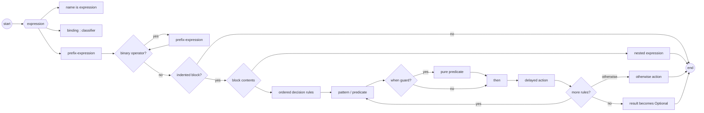
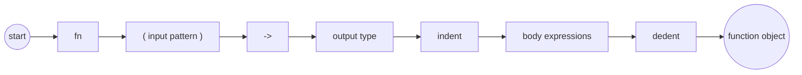

# Topal syntax sketch

This document records the provisional surface syntax for Topal. The syntax is
intended to make composition and dependencies visible while remaining easy to
parse. It describes design direction, not yet a stable language specification.

Testing-specific table syntax is described separately in
[unit testing and structural path coverage](testing.md). Its root vocabulary
becomes available only in a language context constructed with the conventional
`testing` feature argument and remains unavailable to ordinary Topal source
which does not request it. Virtual clock control is the deliberate qualified
exception, as in `testing advance-time 5[s]`.

Introspection-specific operations are described in
[static introspection](introspection.md). They remain visibly qualified through
the compiler-provided `lang` scope, as in `lang view Person`, rather than adding
unqualified reflection keywords to ordinary Topal source.

## Lexical structure

Source is encoded as text and divided into identifiers, literals, symbols,
newlines, and indentation. Spaces are required where adjacent tokens would
otherwise merge, and the formatter will use spaces around operators:

```topal
value + 2
left = right
```

Conventional single-character delimiters do not require surrounding spaces.
`(`, `)`, `[`, `]`, `{`, `}`, and `,` always remain individual structural
tokens; adjoining them does not invent a new token. These are equivalent before
formatting:

```topal
Point(10, 20)
Point ( 10 , 20 )
```

The canonical spelling is provisionally `Point ( 10 , 20 )`. Multi-character
symbols such as `->` must be declared by the language rather than formed from
arbitrary runs of punctuation.

`...` is one such declared symbol. It is accepted only as the openness marker
at the end of an open structural record pattern; it is not a general spread,
rest, range, or wildcard operator.

`_` is a reserved discard identifier. It may occupy an identifier position for
a value which is deliberately left unnamed:

```topal
consume is fn (
  _ : Context,
  value : Value
) -> Result ( Value, ContextErrorCode )
  process value
```

The value is still supplied and classified, but `_` introduces no binding,
cannot be referenced, and does not produce an unused-binding diagnostic. It may
occur more than once because its occurrences do not name the same value. `_`
has no wildcard or other pattern-matching meaning; wildcard syntax remains
undecided.

## Diagnostic control

Compiler warning identities are static objects supplied by `lang`, not strings.
An unknown warning name is an error. Diagnostic control is visibly qualified
and lexical:

```topal
lang disable-warning unverified-law

Associative combine
```

`disable-warning` applies only to the next complete statement in the same
lexical source context. Comments, documentation, and blank lines do not consume
it. The compiler may optionally diagnose a suppression which the statement did
not use.

Longer regions use an explicitly matched warning stack:

```topal
lang push-disable-warning unverified-law

Associative combine
Commutative combine
Identity combine empty

lang pop-disable-warning unverified-law
```

The pop must name the warning on top of the stack. A mismatched or unmatched
pop, or reaching the end of the source context with an unclosed push, is an
error. A region cannot cross a source-file or lexical-context boundary.
Suppressions affect diagnostic presentation only: they cannot suppress errors,
change program semantics, or relabel trusted-unverified evidence as verified.

The deliberately verbose compiler operations remain ordinary static
constructions for binding and composition. Programs may use `is` to establish
shorter local vocabulary without adding implicit warning state or changing the
matching rules above.

## Numeric literals

An integer literal uses decimal notation by default. The prefixes `0b`, `0o`,
and `0x` select binary, octal, and hexadecimal notation respectively:

```topal
42
0b1010
0o755
0xCAFE
```

Underscores may optionally group digits. When they are used, decimal digits are
grouped from the right in groups of three, while digits in a base-prefixed
literal are grouped from the right in groups of four. Every boundary must then
be marked; underscores are not used when the literal contains only one group:

```topal
1_000
12_345_678
0b1010_1100_0011
0o1234_5670
0xCAFE_BABE
```

The ungrouped spellings `1000`, `12345678`, and `0xCAFEBABE` are equally valid.
However, `1000_000`, `0b10_10`, `0xCA_FEBABE`, leading or trailing underscores,
and repeated underscores are invalid. Grouping counts digits after the radix
prefix; the prefix is not part of a group. Hexadecimal digits may use either
case.

A decimal literal may have a fractional part and a base-ten exponent:

```topal
0.1
12.50
1_000.000_125
1.25e3
6.022e-24
```

The integer part is grouped rightward from the decimal point. Fractional digits
are grouped leftward from the decimal point in groups of three; the final group
may be shorter. Exponent digits follow the decimal integer grouping rule,
excluding their optional sign. A decimal point requires digits on both sides.
Base-prefixed literals do not have fractional or exponent forms initially.
Fractional and exponent forms construct exact `Rational` values by default;
their base-ten spelling does not introduce a separate decimal numeric type.
Trailing fractional zeroes do not change numeric identity. An expected
`FixedPoint` type may accept such a literal implicitly when the compiler proves
that it is an exact multiple of the declared quantum.

Applying a numeric type to a literal is exact checked construction. For example,
a library-defined binary approximate type may accept `Binary64 0.5`, while
`Binary64 0.1` is a compile error because exact rational `0.1` is not
representable. Deliberate loss uses a function naming its policy:

```topal
value is 0.1 round-to-even Binary64
```

The complete rounding, directed precision-loss, and saturation vocabulary is
defined by the [number model](numbers.md#explicit-lossy-numeric-functions).

The reserved numeric constants `+Infinity` and `-Infinity` denote the two
infinite endpoints. Their expected numeric type selects the domain; insufficient
context is an error. Each spelling is one token with no internal whitespace and
is not an application of an ordinary unary operator. `-Infinity` cannot satisfy
`Nat` or another nonnegative constraint.

A bracketed unit following a numeric literal or infinity constant constructs a
measured quantity as described by the [quantity and unit model](units.md):

```topal
9.81[N]
250[g]
5[kg]
```

`Dimension`, `AffineDimension`, and `MeasurementUnit` are capitalized static
constructions. An affine unit literal constructs a point, while compiler-derived
`Delta D`, named `delta U`, and symbolic `ΔU` denote differences. Unit
expressions use ordinary whitespace-sensitive `*`, `/`, and `^` operators.
Within one expression, all unit atoms use either symbols or complete names:

```topal
9.81[m / (s ^ 2)]
9.81[Metre / (Second ^ 2)]

5[Δ°C]
5[delta Celsius]
```

Operators and parentheses are shared between the forms, but atoms cannot mix;
`[kg * Metre]` is invalid. The compiler derives `Δ°C` by prefixing `Δ` to the
declared `°C` symbol, so no separate delta-symbol declaration exists.
Enabled measurement prefixes similarly derive one complete atom in each mode:
`cm` and `Centimetre`, `ms` and `Millisecond`, or `KiB` and `Kibibyte`.
Whitespace never separates the prefix from its named unit; `[Centi Metre]` is
invalid. Derived spellings are reserved, and colliding explicit declarations
are rejected rather than resolved by precedence or source order.

The brackets are not part of the numeric literal. Whitespace is permitted, but
the formatter uses the compact spelling shown above.

A minus sign belongs to a numeric literal only when it immediately precedes the
first digit, with no intervening space:

```topal
-42
-0xCAFE
-1.25e3
```

With whitespace after it, `-` is an operator instead: `- 42`. Binary
subtraction uses spaces on both sides, as in `left - right`. The formatter must
preserve this semantic distinction.

Tabs are forbidden in indentation. Blank and comment-only lines do not affect
indentation. An unindent closes the current block.

`#` followed by a space begins a comment. The comment continues through the
remainder of the line and ends at the newline:

```topal
# A whole-line comment.
value is Integer 10 # An end-of-line comment.
```

The separating space is required: `#comment` does not begin a comment. The
`# ` form is part of the stable bootstrap syntax used to read a source file's
[language selection](modules.md#the-language-module) before applying its
selected grammar.

## String literals

A string literal preserves the Unicode sequence between its delimiters. It does
not interpret escape sequences or normalize its contents:

```topal
message is "Hej världen"
```

When the contents include quotes, a literal may name an exact delimiter tag.
The tag immediately precedes the opening quote and immediately follows the
closing quote:

```topal
message is text"He said "hello"."text
punctuation is ---"Quotes such as " and "" remain literal."---
```

The two occurrences of the tag must have exactly the same Unicode sequence.
There is no escape processing inside a tagged literal. A different tag handles
the otherwise conflicting sequence:

```topal
example is outer"This contains "text delimiters"text."outer
```

The ordinary quoted form is the empty-tag case. A run of three or more quotes
is a quote-only tagged delimiter, so triple quotes follow the same model rather
than introducing a separate kind of string:

```topal
ordinary is "Literal string"
empty is ""
quoted is """A "quoted" literal"""
```

Literal tags are lexical delimiters, not identifier references. A tag may use
any NFC source character except whitespace and the structural delimiters `()`,
`{}`, and `[]`; a tag made only of quotes supplies the quote-only form above.
The enclosed contents may contain any valid Unicode sequence. Whitespace
separates ordinary tokens, so these remain distinct constructs:

```topal
ascii is Ascii "ASCII text"       # Apply Ascii to an ordinary literal.
raw is ascii"Unescaped "text""ascii # Use ascii as a literal tag.
```

The first expression applies `Ascii`; it does not give the literal an encoding.
Source files are UTF-8, but a literal constructs an unencoded `String` unless a
constraint or conversion explicitly gives it another property.

## String formatting

Formatting is an operation on an ordinary string template, not a literal
encoding or a distinct fundamental string type. Braced names in a template are
resolved from an explicit map supplied as the other operand of `format`:

```topal
player is "Nanne"
score is Nat 233
high-score is Nat 344

message is "Player: {player}, Score: {score}, High score: {high-score}" format (
  player is player,
  score is score,
  high-score is high-score
)

print message
```

Placeholders are names rather than general expressions. The explicit map keeps
the formatted expression's dependencies visible and permits template names to
differ from bindings at the call site:

```topal
score-line is "Player: {name}, Score: {current}, High score: {highest}"

message is score-line format (
  name is player,
  current is score,
  highest is high-score
)
```

The result is `String`. Values accepted by the map provide the formatting
capability; formatting does not assign an encoding to the template or result.
When the template is statically known, the compiler checks that every named
placeholder has a supplied value. Format specifications and a spelling for
literal placeholder delimiters remain provisional.

## Expressions and application

A function with one input uses prefix notation:

```topal
print "Hello"
Integer 10
static function
```

A function with two inputs uses infix notation. The left input is normally
the primary object being operated on, while the right input supplies the other
argument:

```topal
value + 2
text contains "error"
collection map transformation
```

A function has zero, one, or two syntactic operands. A zero-operand call uses
the empty argument list so that invoking a function remains distinct from
referring to it as a value:

```topal
current-time ()
```

Values beyond the two-operand limit must be packaged into one or both operands
explicitly. Parentheses make the extra structure visible: a comma-separated
positional argument list has no labels, while a labeled product associates
names with values using `is`:

```topal
( left-source, left-fallback ) combine ( right-source, right-fallback )
( left-source is left, left-fallback is 0 ) combine (
  right-source is right,
  right-fallback is 0
)
```

The second form does not add four operands to `combine`; it supplies two
labeled-product operands, each containing two associations. An expected record
or map type determines whether those associations are static fields or dynamic
entries. Chaining another application applies the result of the first
application rather than adding a third operand.

Binary application associates from left to right and has no operator-specific
precedence:

```topal
a f b g c
```

means:

```topal
( a f b ) g c
```

Parentheses override this grouping. Indentation can supply a grouped expression
without accumulating closing parentheses:

```topal
a f
  b g c
```

means:

```topal
a f ( b g c )
```

Mixing familiar operators does not introduce hidden precedence. Code must group
the intended operation explicitly when left-to-right evaluation is not wanted.

## Products and construction

A comma constructs or separates components of a product inside delimiters:

```topal
( 10 , 20 )
```

Types and other constructors use ordinary prefix application:

```topal
point is Point ( 10 , 20 )
```

### Named construction fields

A constructor with named parameters receives a parenthesized list of
`name is value` associations:

```topal
CentAmount is FixedPoint (
  radix is 10,
  fractional-digits is 2
)
```

The constructor or an expected constructed type supplies the closed field
schema. Field order does not affect identity unless that constructor explicitly
defines an order, and unknown, duplicate, missing required, or inapplicable
fields are errors. A single named field needs no trailing comma:

```topal
Biased is BiasedBinary (
  bias is 127
)
```

This is structural syntax, not ordinary function application: `bias is 127` is
one named association, whereas `bias 127` applies the object named `bias`.
Parentheses containing `name is value` are consequently a named-argument list,
not a grouped lexical binding. A lexical binding uses binding position outside
an association list.

Named arguments do not infer a new anonymous record type by themselves. They
must be consumed by a constructor or expected record type which declares their
fields. An anonymous record remains explicit about each inferred field type:

```topal
point is (
  x : Float is 12.5,
  y : Float is 7.0
)
```

Map entries use the same `is` association token, but an expected `Map ( K, V )`
permits arbitrary expressions of `K` on the left rather than static field
labels. Parsing retains the association shape; the expected construction decides
whether it is a named field or a map key and validates it accordingly.

Layouts are the deliberate attribute-first application. The parser still
groups their parenthesized associations before `Layout`, while semantic checking
propagates the field schema from `Layout T` back to that argument:

```topal
UInt32LE is (
  storage-size is 32[b],
  encoding is UnsignedBinary,
  endian is Little
) Layout Nat
```

The same structural shape can be used as a pattern:

```topal
point
  Point ( x , y ) then x + y
```

Whether `Point ( x , y )` constructs or matches is determined by its expression
or matcher context. Its tokenization and grouping do not change. Matcher context
is established structurally by a function header or by the left side of
`then` in a decision-table rule; a separate `match` introducer is not needed.

## Algebraic data declarations

Topal names the positional product `Tuple`, the labeled product `Record`, the
positional sum `Variant`, and the labeled sum `Union`. A union is what is also
commonly called a tagged union; all Topal union alternatives are tagged, so the
shorter source name is sufficient.

Tuple types use a positional type list, and tuple values use the corresponding
product expression:

```topal
Coordinate is Tuple ( Float, Float )

position : Coordinate
position is ( 12.5, 7.0 )
```

A record declaration classifies each static field label:

```topal
Person is Record
  name : String
  age : Nat
```

Record construction associates those labels with values. The constructor
provides the context which distinguishes these fixed field associations from
dynamic map entries:

```topal
ada is Person (
  name is "Ada",
  age is 36
)
```

Record field selection places the static field label after the record value:

```topal
name : String
name is ada name
```

Unlike map lookup, selection of a declared record field is total and produces
that field's precise declared type. It is a structural record operation rather
than a unary function application. Selection groups with its record before
ordinary application, so `operating-system close file descriptor` applies
`close` to `file descriptor`.

An anonymous record combines field classification and initialization:

```topal
pair is (
  a : Int is 5,
  b : String is "Hello"
)
```

This is distinct from both a positional product and a map. In particular,
`( a : Int is 5, b : Int is 6 )` remains a record despite its homogeneous field
types. It may be converted explicitly to `Map ( String, Int )`, but conversion
forgets statically guaranteed field presence and changes field selection into
ordinary partial map lookup.

A positional variant selects an alternative with `at` and a zero-based finite
index:

```topal
Scalar is Variant ( String, Nat, Boolean )

text is Scalar at 0 "hello"
count is Scalar at 1 42
```

The selected position is part of both construction and matching:

```topal
scalar
  Scalar at 0 text then print text
  Scalar at 1 count then print count
  Scalar at 2 enabled then print enabled
```

A union labels its alternatives:

```topal
State is Union
  Idle
  Running : Progress
  Failed : Error
```

An unclassified alternative carries `Unit`. Classified alternatives accept one
payload, using ordinary application for construction and the same form for
matching:

```topal
state is Running progress

state
  Idle then start ()
  Running progress then display progress
  Failed problem then report problem
```

Several payload components are packaged in a tuple or record. Union syntax does
not introduce a separate inline product mechanism:

```topal
Message is Union
  Move : Tuple ( Float, Float )
  Stop

message is Move ( 10.0, 20.0 )
```

See [containers and algebraic data](containers.md#algebraic-foundation) for the
semantic relationships among tuples, records, variants, unions, and maps.

## Bindings and classification

`is` introduces an immutable binding in binding position. Inside a delimited
named construction, record construction, reconstruction, or map construction,
it instead associates the entry on its left with the value on its right:

```topal
limit is Integer 10
number-type is Integer
```

Because types are first-class objects, this distinction is significant:

```topal
text is String
```

binds `text` to the type object `String`. It does not declare a string value.

Outside those delimited association lists, the sole non-binding left side is an
explicitly qualified current task field:
`@ field is expression` performs the task-state replacement defined under
[tasks](#tasks). Outside a delimited association list, a bare identifier before
`is` always introduces a binding.

`with` is the immutable record-reconstruction operator:

```topal
updated-person is person with (
  age is person age + 1
)
```

The right-side field associations replace those fields while every unspecified
field is retained from `person`. The result has the same complete record type.
Construction rechecks field invariants and requires any dependent field whose
evidence is invalidated to be replaced or re-established. No alias of `person`
is mutated.

Inside a map construction, `is` associates the key on its left with the value
on its right. It remains a value association rather than a classification or
lexical binding:

```topal
counts is Map ( String, Nat ) (
  "apple" is 2,
  "pear" is 3
)
```

An empty value is constructed by applying the fully specified map type to the
empty argument list. When a binding already provides the expected type, only
the value construction is needed:

```topal
empty-counts is Map ( String, Nat ) ()

other-counts : Map ( String, Nat )
other-counts is ()
```

The explicit map type or an expected map type distinguishes these dynamic,
homogeneous associations from record fields. Equal field types do not by
themselves make an anonymous record a map.

`:` classifies a value, binding, or pattern with the classifier on its right:

```topal
text : String
index : Integer
```

The classifier may be a type, a constraint which retains its base type, or a
capability applicable to a static object. Classifications may consequently
chain:

```topal
values : ( C : Sortable )
```

The parenthesized classifier binds `C` with the subject kind supplied by
`Sortable` and classifies `values` by that complete `C`. Because `Sortable`
classifies types, this also establishes `C : Type`; spelling
`C : Type : Sortable` is valid but redundant. The complete input type can then
appear in a function's output type. A bare `C` would remain invalid because no
classifier would introduce it.

A construction pattern explicitly classifies every newly introduced binding:

```topal
left : Tuple (
  A : Type,
  B : Type
)

right : Tuple ( A, B )
```

The later bare occurrences refer to the exact objects already bound. A bare
unbound name is not introduced implicitly. `Subject : Object` captures any
language object when the construction genuinely permits every kind; its actual
kind remains available for later refinement.

`_` discards one classified construction parameter:

```topal
array : Array (
  _ : Nat,
  Int
)
```

The parameter must be present and satisfy `Nat`, but receives no local name.
This does not give `_` general wildcard behavior. The actual size remains part
of the complete array type. Naming it instead uses `array-size : Nat`.

An open record pattern uses `...` only as an openness marker:

```topal
value : Record (
  id : Identifier,
  ...
)
```

It matches anonymous structural records with at least the stated visible
fields. `...` neither binds a record row nor grants reconstruction authority.
Nominal records match only through an explicitly published structural view;
private and opaque fields do not participate outside their visible context.

A partially applied relational capability receives the object established by
the preceding classification as its first component:

```topal
consumer : ( C : Object : DependsOn P )
operation : ( O : Object : Independent ( OtherA, OtherB ) )
```

These establish the conceptual evidence:

```text
DependsOn C P
Independent ( O, OtherA, OtherB )
```

The first form means that `C` is the dependent and `P` the prerequisite. The
separate colons preserve ordinary left-to-right classification;
`consumer : C DependsOn P` is not an alternative infix spelling.

## Constraints and refined types

A constraint is a first-class object which limits values of one base type. The
base type is the left operand of `constraint`, and the right operand is an
inferred anonymous predicate:

```topal
CamelCase is String constraint { value }
  verification-body value

name : CamelCase
```

The kinds are conceptually:

```topal
String    : Type
CamelCase : Constraint String
```

The constraint already retains its base type, so classification does not repeat
`String`. Static values are checked during compilation; dynamic values require
validation and produce evidence on success. The successfully classified value
is still a `String`, refined by the retained evidence. A constraint can occupy
a classified component of a type construction, as in `List CamelCase`; the
component uses the constraint's base type and retains its evidence.

Constraints compose as matchers:

```topal
InteriorIndex is Nat constraint { index }
  index >= 0 and index < length

index : InteriorIndex
```

`and` retains both pieces of evidence, while `or` records which compatible
alternative succeeded.

### Constraints on type fields

A field's classification may use a refined type. Later fields may refer to
earlier fields in the same declaration, making relationships between components
part of the declared type:

```topal
pub Interval is Record
  pub start : Integer
  pub end : Integer constraint { end } end > start
```

Here `end` is an `Integer` constrained to be greater than the particular
`start` in the same `Interval`; the declaration describes a dependent product,
not two independently classified integers. The constraint evidence remains
attached to the value when its fields are projected or matched.

Dependencies follow declaration order. A field may refer only to fields
declared before it, so forward references and cyclic field constraints are
invalid. Constraints involving several fields can consequently be placed on a
later field once every value they need has been declared.

Constructing a value must establish every field constraint. Statically known
components are checked during compilation, and a violated constraint is a
compile-time error. When the components are dynamic and the relationship is not
already proven, construction performs validation and produces
`Result ( Interval, ConstraintErrorCode )` on success:

```topal
pub interval is fn (
  start : Integer,
  end : Integer
) -> Result ( Interval, ConstraintErrorCode )
  Interval (
    start is start,
    end is end
  )
```

This field syntax states an invariant of every value of the declared type. A
separate constraint whose base is `Interval`, by contrast, refines only values
successfully classified by that constraint and does not make it true of every
plain `Interval`.

## Function definitions

`fn` is a prefix constructor for a function object. A definition binds that
object using `is`:

```topal
strlen is fn ( text : String ) -> Integer
  body
```

The input is a pattern, `->` separates it from the output type, and the indented
block is the body. `()` declares zero operands, a single pattern declares one,
and two components declare the left and right operands of an infix function:

```topal
current-time is fn () -> Instant
  body

strlen is fn ( text : String ) -> Integer
  body

minimum is fn ( left : Integer , right : Integer ) -> Integer
  left
    < right then left
    otherwise right
```

A component may itself be a parenthesized positional argument list or a map.
Map entries are declared with `:` because the declaration classifies each name;
calls supply them with `is` because they associate names with values. An entry
may use `default` followed by its default value:

```topal
zip-longest-default-zero is fn (
  (
    left-list : List Nat,
    left-fallback : Nat default 0
  ),
  (
    right-list : List Nat,
    right-fallback : Nat default 0
  )
) -> List ( Nat, Nat )
  body
```

Every parameter name must be unique across the entire function, including names
packaged into different operands. A call may omit the defaulted associations or
override them:

```topal
( left-list is left ) zip-longest-default-zero ( right-list is right )

(
  left-list is left,
  left-fallback is 10
) zip-longest-default-zero (
  right-list is right,
  right-fallback is 20
)
```

Defaults fill omitted map associations; they do not remove an entire syntactic
operand or turn a binary function into a unary one. Unknown and duplicate
association names are errors.

The input and output types are mandatory parts of a function declaration.
They are not inferred from the body. In particular, an output of `Integer`
promises an infallible function, while a fallible function declares
`Result ( Integer, ParseErrorCode )` explicitly:

```topal
parse-count is fn ( text : String ) -> Result ( Integer, ParseErrorCode )
  body
```

Every fallible function explicitly names its complete error-vocabulary
component. It may name types from any reachable namespace, including
vocabularies shared with other functions, as described by
[the error model](errors.md). No specially named local error type is resolved
implicitly.

Errors are ordinary result values rather than exceptions. A successful value
may be projected from a `Result` inside an explicitly fallible function, as
described by [the error model](errors.md#success-projection-and-propagation).
When a scope accounts for several results, anonymous composition permits at
most one value-producing success component. If every value-producing result is
bound, their binding names instead form the fields of an anonymous success
record. In both forms the error vocabularies are flattened and deduplicated;
see [result composition](errors.md#composing-results).
Effects complement the input and result types according to the
[effect model](effects.md). They reuse capability-style classification syntax
but describe possible interactions rather than promises. An explicit upper
bound follows the completed function type:

```topal
read-document is fn (
  file : File
) -> Result ( Document, DocumentErrorCode )
  : Read file
```

The resource parameter must resolve to an existing identity visible at the
declaration. A higher-order input is classified directly:

```topal
read-with is fn (
  file : File,
  reader : ( F : Read file )
) -> Result ( Bytes, FileErrorCode )
  reader file
```

`F : Read file` implies `F : Function`. Effect expressions use `and`, `or`, and
static combination functions like capability expressions; `Effects ()` is the
empty set. The explicit expression is an upper bound, while compiled
implementation evidence retains the exact inferred effects.

Argument-dependent [resource complexity guarantees](performance.md) use the
same post-return classification position:

```topal
sort is fn (
  values : C : Sortable
) -> C
  : OExec ( (values size) ^ 2 )
    and OAlloc ( values size )
```

`OExec` and `OAlloc` directly accept Ordo expressions over visible static
measures; an extra `Ordo` construction is not written. `NoAlloc` is the
separate exact promise that no valid application dynamically allocates.
Complexity classifiers may combine with capabilities, but missing complexity
evidence never supplies missing semantic capability evidence.

Canonical capability evidence retains the exact ordinary function identity
assigned to each operation role. Explicitly classifying an operand selects that
certified role:

```topal
value is ( container : Indexed ) get index
```

The compiler uses the `get` identity from `container`'s canonical `Indexed`
evidence rather than restarting ordinary overload resolution. Without the
classification, `container get index` retains normal source-ordered overload
selection.

`Capability operation` forms a static role reference when no concrete operand
is present:

```topal
RandomAccess is Indexed and
  ( Indexed get : OExec ( 1 ) )
```

Both terms classify the same surrounding subject. `Indexed get` projects an
ordinary operation identity; it neither invokes the function nor introduces an
`Indexed` namespace. Multi-component capability evidence retains its associated
component identities in the same projection.

A call may classify the selected function with a hard resource requirement:

```topal
found is mycontainer
  ( search : OExec ( size mycontainer ) )
  my-key
```

`Prefer` instead supplies soft selection goals. Its product order is
lexicographic, while ordinary classifier `and` remains order-independent:

```topal
found is mycontainer
  (
    search
      : Prefer (
          OAlloc ( size mycontainer ),
          OExec ( (size mycontainer) ^ 2 )
        )
  )
  my-key
```

Applicable implementations satisfying the first preference are favored before
the second is considered. Tighter comparable evidence wins within a preference;
source order resolves equivalent, incomparable, or unsupported preferences.
Failure to satisfy `Prefer` never invalidates the call. Hard evidence and soft
selection may be combined, as in
`NoAlloc and Prefer ( OExec ( size mycontainer ) )`.

[Constructed package and module contexts](contexts.md) provide immutable
namespace members selected with `@`; constructor-backed access is tracked by
the compiler without adding ordinary inputs to every function declaration.

A value may be classified with compiler-checked
[`Sensitive T`](sensitive.md) provenance:

```topal
password : Sensitive String
```

Directly represented information retains the classification through copying,
moving, borrowing, containment, and transformation. `Leakage` separately gives
quantitative worst-case bounds for conclusions and indirect observable channels:

```topal
verify-password is fn (
  supplied : Sensitive String,
  expected : Sensitive String
) -> Boolean
  : Leakage (
      supplied <= 1[b],
      expected <= 1[b]
    )
  supplied == expected
```

The selected implementation must satisfy the complete modeled observation
bound, including derivable timing behavior. Boundary parameters use
`parameter : Sensitive Type` to accept direct sensitive information.

Generic parameters, capability evidence, component objects, type identity, and
conversion are described by [generic abstraction and semantic
capabilities](abstractions.md). Function headers use classification and static
type matching rather than separate generic-parameter or capability-bound
syntax. Capabilities do not introduce type-owned method scopes or a template
language.

### Inferred anonymous functions

Small functions passed directly to another function may omit `fn` and their
types when the surrounding application determines one function type. A
braced parameter pattern is an inferred anonymous-function header; the
following expression or indented block is its body:

```topal
values map { value }
  value * 2

values fold 0 { sum, value }
  sum + value

mapping entries foreach { ( key, value ) }
  print key value
```

For example:

```topal
{ value }
  value * 2
```

in a context expecting `fn ( Int ) -> Int` is shorthand for:

```topal
fn ( value : Int ) -> Int
  value * 2
```

The braces delimit parameter patterns, not the body. A short body may remain
on the same line:

```topal
values select { value } value > 0
```

Destructuring and multiple inputs use the ordinary pattern model. Both the
input and output types come from context; they are not inferred solely from an
unconstrained body. If overload selection or a stored binding does not provide
one expected function type, the full `fn` form is required. The full form is
also required to declare `static`, explicit effects, or any other guarantee
that forms part of the function type.

### Overloading and type association

Multiple functions may share a name. An overload is unique by its input
parameter types and its staticness; parameter names and the output type do not
distinguish overloads. Consequently, ordinary and static functions with the
same name and input types may coexist:

```topal
size is fn ( value : Data ) -> Integer
  runtime-size value

size is fn static ( value : Data ) -> Integer
  encoded-size value
```

A context which requires static evaluation considers only static overloads. If
several overloads have the required staticness, the compiler tests them in
source declaration order and selects the first whose input header matches.
This is the same ordered-choice rule used by pattern matching. It does not rank
an exact concrete type above a construction or capability pattern, and the
expected output type never changes the choice.

Authors consequently place narrow or preferred cases before general fallbacks:

```topal
describe is fn ( value : Integer ) -> String
  describe-integer value

describe is fn (
  value : ( T : Formattable )
) -> String
  format value
```

Reversing these declarations intentionally gives the `Formattable` case
precedence for integers which satisfy it. `Formattable` already establishes
`T : Type`. The compiler may optionally diagnose overlapping,
conversion-preempted, or provably shadowed overloads. Such diagnostics describe
the consequence of the order and are not required for a valid program.

Overload order is local to the namespace containing the declarations. `use`
makes a published scope available under its qualified name; it does not merge
that scope's functions into the using namespace. A qualified call selects its
namespace before the declarations under that name are searched. A scope alias
preserves the selected namespace and its declaration order. Cross-namespace
composition of complete overload sets requires future explicit binding syntax;
imports and their filesystem discovery order never merge overloads implicitly.

Types do not introduce function scopes. A function declaration instead
shows whether and how the function is related to a type through its input
parameters. This keeps operations independently composable while overloading
provides the shared vocabulary that type-local function names would otherwise
supply.

### Static functions

Static evaluation is an optional part of a function's type contract. The
`static` modifier follows `fn` so the guarantee is preserved in higher-order
types as well as definitions:

```topal
increment is fn static ( input : Integer ) -> Integer
  input + 1
```

A static function may call only other static functions, may not depend on
runtime-only state or observable effects, and must have provably bounded
execution. Bounded execution means that the compiler can prove termination for
every permitted input; the bound may depend on the input and need not be
constant. Finite traversal and recursion with a provably decreasing measure can
therefore be static.

When all arguments are statically known, a static call can be evaluated during
compilation and may be used where a static construct is required, including in
the construction of a new type. Whether an individual expression or binding is
statically known is inferred; variables do not require a separate `static`
modifier.

Staticness remains visible when functions are passed as values:

```topal
apply-statically is fn static (
  transformation : fn static ( Integer ) -> Integer,
  input : Integer
) -> Integer
  transformation input
```

A static function can be used where an ordinary function of the same input
and output types is expected because forgetting the guarantee is safe. An
ordinary function cannot be used where a static one is required. The compiler
checks the declaration at the first violated static dependency, keeping errors
local instead of reporting only when a distant caller attempts to construct a
type.

## Interfaces

`Interface` constructs a type from function and generator declarations without
choosing their implementations:

```topal
Lexer is Interface
  warm-up is fn ( configuration : Configuration ) -> Unit
  parse is fn ( command : String ) -> Result ( ParseResult, LexerErrorCode )

  parse-tokens is generator ( source : String )
    yields Token
    resumes Unit
    -> Result ( ParseResult, LexerErrorCode )
```

Applying the interface in a source context checks a complete implementation:

```topal
Lexer
  warm-up is fn ( configuration : Configuration ) -> Unit
    initialize configuration

  parse is fn ( command : String ) -> Result ( ParseResult, LexerErrorCode )
    parse-command command

  parse-tokens is generator ( source : String )
    yields Token
    resumes Unit
    -> Result ( ParseResult, LexerErrorCode )
    implementation
```

These functions belong directly to the surrounding context and retain ordinary
visibility. No intermediate namespace or value is introduced. Different
packages, modules, libraries, applications, and source scopes may independently
implement and publish `Lexer`.

A construction can instead be named when a first-class implementation must be
passed, returned, stored, selected, or composed:

```topal
local-lexer is Lexer
  required declarations
```

The compiler verifies missing, duplicate, and incompatible declarations at the
construction. It attaches inferred effects, implementation properties, and
optimization evidence to the context or packaged implementation rather than to
the implementation-independent interface type.

Tasks may implement the same interface through message passing. A function
returning `Unit` becomes an event. Completion and value requests must return
`Result ( Completed, ApplicationErrors )` and
`Result ( Value, ApplicationErrors )`; plain response types are not valid
message handlers. A task generator's final return must also be `Result`;
generators become streams. See
[function and message interfaces](interfaces.md) for construction, visibility,
implementation evidence, and message adaptation.

## Tasks

A task owns private state and derives a typed messaging protocol from functions
declared in its context. `Task` first accepts an option record to construct a
specialized task type; a definition is then a value of that type:

```topal
Counter is Task (
  queue-size is 10,
  identity is counter
)

counter-service is Counter
  count : Nat

  start is fn ( initial : Nat ) -> Completed
    @ count is initial
    Completed

  increment is fn (
    _ : MessageContext,
    amount : Nat
  ) -> Unit
    @ count is @ count + amount

  current is fn (
    _ : MessageContext,
    Unit
  ) -> Result ( Nat, () )
    @ count
```

`@ field` reads a field of the current task context. Task-field replacement
always keeps that qualification on the left side:

```topal
@ count is @ count + amount
```

The new immutable value is constructed and validated before installation.
`count is @ count + amount` instead creates an ordinary local binding and never
updates task state. Non-task context members remain immutable and cannot appear
on the left of qualified replacement.

Applying the definition constructs a task by supplying the parameters of
`start`:

```topal
counter is counter-service 0
counter increment 2
value : Nat is counter current Unit
```

The option record configures the task and specializes its type; it does not
list implemented interfaces. Interface conformance is established by the
definition's actual handlers. The compiler registers each definition's
structured namespace identity, endpoint, and implemented interfaces with the
service broker described in
[tasks and intrinsic messaging](tasks.md#service-discovery).

Every task definition has a mandatory, non-callable `start` lifecycle handler.
An ordinary task may define
`terminate : TerminationReason -> Unit`; the task itself, its owning
instantiated `Task` value, or its enclosing scope may invoke it. It remains
unavailable through a discovered endpoint. Omission supplies a no-op before
normal resource cleanup. The application root is the exception: its `terminate`
result follows the selected platform contract and becomes the application
return value. These lifecycle declarations do not require or construct a
`TaskInterface`.

Hard `terminate` invalidates suspended handlers after the lifecycle handler
returns and proceeds to automatic cleanup. A message handler which needs those
handlers to finish may instead end with `terminate-cleanly reason`.
`terminate-cleanly` stops admission, completes queued and new requests with
`task-terminated`, waits for already-suspended handlers, runs the lifecycle
handler, and cleans up. It is permitted only as the terminal expression of a
handler returning `Unit` or `Result ( Completed, TerminationErrorCode )`; the
latter replies after termination finishes.

Every dispatched ordinary handler has a leading `MessageContext` containing
the session identity and sender endpoint. The compiler projects this input away
when checking the handler against an implementation-independent `Interface`;
direct implementations do not receive it. `_ : MessageContext` visibly
discards the context name when it is unused. The distinguished context slot
does not count against the interface operation's zero-to-two ordinary operands.

A handler returning `Unit` is an event for which the caller does not await
completion. Every ordinary handler with a response channel returns `Result`:
`Result ( Completed, ApplicationErrors )` requests completion confirmation,
and `Result ( Value, ApplicationErrors )` requests a value. Plain `Completed`,
plain value, and function `Result ( Unit, ApplicationErrors )` results are
invalid message-handler shapes. A generator handler establishes a stream and
its final return must be `Result`; the language-defined `task-terminated` code
extends the effective error-code set without adding another wrapper.

`match-first` initiates reply-bearing requests together and uses ordered
interaction rules:

```topal
result is match-first
  response is primary request payload then Primary response
  response is fallback request payload then Fallback response
```

The first committed response selects its action. Source order breaks a tie at
the same logical point. Every alternative must have implementation evidence
proving that speculative execution has no externally observable side effects;
later replies are accepted and discarded without cancelling their requests.

`match-all` waits for every labeled response and returns their product:

```topal
responses is match-all
  primary is primary request payload
  fallback is fallback request payload
```

It observes every complete `Result`, does not short-circuit on failure, and may
use effectful requests. Their dependency evidence determines which may run in
parallel and rejects unordered conflicts.

A reply-waiting expression may be given a relative monotonic timeout:

```topal
response is 5[s] with-timeout ( network request packet )
```

Parentheses group a right operand kept on the same line. Indentation replaces
them for a multiline operand:

```topal
response is 5[s] with-timeout
  network request packet
```

The formatter never retains both grouping forms. `with-timeout` is invalid for
a `Unit` event. For a request, `match-first`, or `match-all`, it times the immediate
complete wait. For a stream it applies the duration independently to the first
yield or final return and, after each resume, to the next yield or final return.
There is no active timer while the consumer handles a yielded value.

A group timeout surrounds `match-first`; its individual alternatives cannot be
timed. `match-all` permits a group timeout, separate timeouts on its request fields,
or both. An individual timeout becomes that field's response and `match-all` still
waits for every other field.

The construction adds `TimeoutErrorCode` to an existing effective `Result`. If
the immediate wait instead produces a non-`Result` `T`, including a `match-all`
product, it produces `Result ( T, TimeoutErrorCode )`. It does not wrap stream
yields. It returns `timeout-error timeout-occurred` under the
`lang with-timeout` domain when an interval expires. A stream timeout abandons
the continuation and uses the ordinary `generator-closed` path. The compiler
hides the absolute monotonic deadlines, timeout IDs, server messages,
cancellation, and late-result handling.

Timeout never proves that a request's effects did not occur. Outstanding effects
remain in the dependency graph, and a conflicting retry requires protocol
evidence such as idempotency, deduplication, status lookup, or transactions.

See [tasks and intrinsic messaging](tasks.md) for identity namespaces, service
discovery, isolation, startup and termination, and the implicit root task
defined by `application.t`.

## Destructors

Every type has a destructor. Types which represent external resources may
declare cleanup in addition to the default destruction of owned components and
storage. `destructor` uses a function-shaped declaration while constructing a
non-callable language object:

```topal
File is type
  descriptor : FileDescriptor

  destroy is destructor (
    file : File
  ) -> Result ( Unit, ResourceErrorCode )
    operating-system close file descriptor
```

A destructor's parameter identifies its complete owned type and is a terminal,
non-escaping borrow. The value remains available for cleanup but cannot be
moved, retained, returned, or otherwise resurrected. The binding name is
ordinary; each complete owned type has at most one destructor in its definition
context, regardless of that name.

`destructor` does not imply `Function`, cannot be called or passed as a value,
and does not participate in overload resolution. It may return only `Unit` or
`Result ( Unit, ResourceErrorCode )`; it cannot produce a replacement value.
After its body, Topal destroys owned components in reverse construction order
and releases storage even when cleanup fails. A function
accepting a value with a fallible destructor must itself permit a `Result`,
because its reference may be the final one. Ownership transfers, borrowing,
sharing, and reference-count elimination are compiler decisions rather than
surface syntax. A successful resource acquisition may bind an ordinary
continuation directly:

```topal
result is file-system open-file path { file }
  process file
```

The binding supplies the lexical lifetime; Topal has no generic
`with-resource` construct. Returning a resource—or a containing value—from the
continuation is the ordinary source-level indication that its lifetime moves to
the receiving scope. See
[resource lifetime and destruction](resources.md) for the semantic rules.

Non-owning resource back references use the language-defined `Weak`
capability-backed construction:

```topal
Control is type
  window : Weak Window
```

Access has effective type `Result ( Window, WeakErrorCode )` and returns
`weak-unavailable` when the target can no longer be retained:

```topal
window : Window is control window
```

Applying the weak value to a block retains it once for that complete region:

```topal
control window { window }
  update-title window
  redraw window
```

The block does not run when retention fails. Its inner binding is an ordinary
retained `Window`; returning that value moves its lifetime to the receiving
scope under the normal ownership rules.

The same construction provides non-owning task monitoring:

```topal
worker-monitor is Weak worker

worker-monitor { worker }
  worker status Unit
```

Promotion returns `weak-unavailable` if the task instance can no longer be
retained. A subsequent request may independently return `task-terminated` if
termination has committed. The promoted value does not consume the owning
scope's final join result. Restricted task endpoints remain ordinary messaging
authorities rather than weak values.

## Generators

Resumable functions use an explicit `generator` declaration. They may yield a
value, receive a value on resumption, and eventually return a distinct final
value:

```topal
conversation is generator ( initial : Request )
  yields OutgoingRequest
  resumes IncomingResponse
  -> Result ( Conversation, ConversationErrorCode )

  response : IncomingResponse is yield make-request initial
  finish-conversation response
```

`yield value` has effective type
`Result ( ResumeValue, GeneratorErrorCode )`. Normal resumption produces the
declared resume value; abandonment produces the language-defined
`generator-closed` error. The generator may handle that result to perform
deliberate shutdown work, or allow the close signal to reach the generator
boundary. It may not yield again after observing closure. Automatic cleanup
runs after it exits, and no explicit generator-cancellation operation is
available to the consumer.

Applying the generator supplies its initial input and starts it; there is no
separate `start` operation. A suspended `yield` expression evaluates to the
value supplied when its continuation is resumed. Generators resumed with
`Unit` support direct traversal:

```topal
generator-value is values first

generator-value foreach { value }
  print value
```

See [generators](generators.md) for continuation behavior, return values, and
the separation between generators and message-passing infrastructure.

## Predicates and partial application

A binary relation can be fully applied:

```topal
2 < 5
```

Omitting its left operand constructs a predicate section:

```topal
< 5
```

This is equivalent to a function awaiting a subject:

```topal
value -> value < 5
```

There is only one definition of `<`; section syntax derives its unary predicate
form. `and` and `or` combine predicates about the same subject:

```topal
> 2 and < 5
= 0 or = 10
```

`and` and `or` have equal precedence and group left to right. Mixing them should
use explicit grouping; the compiler may require it to avoid conventional
precedence assumptions:

```topal
( > 2 and < 5 ) or = 10
```

Ordinary block value, immutable shadowing, `return`, recursion, termination, and
generator productivity follow the [execution and totality](execution.md) rules.
Within each declaration scope, complete declaration headers are visible while
definitions are checked, regardless of their source position. This permits the
compiler to infer mutually recursive function groups without a grouping
construct. Evaluated initializer values remain subject to their ordinary
construction dependencies.

When termination is not otherwise inferable, `Decreases` classifies the
complete function after its return type:

```topal
search is fn (
  active : List Node,
  deferred : List Node
) -> Optional Node : Decreases ( active size + deferred size )
```

The arguments are pure measure expressions over the function inputs. Multiple
arguments form a lexicographic measure. The compiler may infer the same evidence
without source syntax, but an explicit capability is required when an opaque,
interface, or higher-order declaration needs to publish the relationship.

## Decision tables

An expression followed by an indented list of rules supplies the subject for
each rule:

```topal
checked-value
  > 5 then print "Too high"
  < 2 then print "Too low"
  otherwise print "Just right"
```

Rules are considered from top to bottom. The first matching rule is selected,
and only its action runs. Guards must be pure and total; actions may have effects.
`then` structurally separates a matcher from its delayed action, so it does not
participate in operator precedence.

A complete table returns the common action result type. An incomplete table
returns an optional result:

```topal
value
  > 5 then calculate value
```

has type `Optional Result`, while adding `otherwise` makes its type `Result`.
Ignoring an optional result may produce a warning when it appears accidental.

Successful decisions refine the active constraints. For example, the selected
branch below carries evidence that the index is in bounds:

```topal
index
  >= 0 and < collection length then collection get index
  otherwise return error OutOfBounds
```

## Patterns and matchers

Patterns use the same ordered decision-table form:

```topal
result
  Ok value then return value
  Error problem then report problem
```

A rule's terminating `then` places the preceding `Ok value` or `Error problem`
in matcher context. Consequently these forms cannot be parsed as constructor
applications in this position, even though construction and matching
deliberately have the same spelling. The subject and indented rules already
provide the complete decision-table structure; no additional keyword occurs
between the subject and its patterns.

A successful pattern may introduce bindings and evidence. These are available
only in its action. Patterns and predicates share a general matcher abstraction,
so `and` and `or` have one meaning: combine compatible matchers over the same
subject.

The same decision-table form opens an existential package:

```topal
filtered
  (
    M : Nat,
    result : Array M T,
    size-proof : M <= N
  ) then
    use result
```

The existential declaration of `filtered` marks `M` as a fresh static
component. All three bindings are scoped to the action. Because an existential
package has its one declared product shape, this single rule is exhaustive.
`_ : M <= N` may discard the proof name while retaining the evidence needed to
check the pattern.

When the action result depends on `M`, the complete decision expression
automatically existentially closes over it:

```topal
trimmed is filtered
  (
    M : Nat,
    result : Array M T,
    _ : M <= N
  ) then
    result
```

Here `trimmed` has `exists M. Array M T`. An action cannot leak a fresh static
identity without this closure. Ordinary classification may instead forget the
package to a weaker visible classifier when every possible witness supports
that classifier.

Both alternatives of `or` must expose compatible bindings:

```topal
response
  Timeout reason or Disconnected reason then retry reason
```

When alternatives bind different names or types, separate rules are used.

`when` adds a pure predicate after structural matching, when names introduced by
the pattern are available:

```topal
person
  Person (
    name is name,
    age is age
  ) when age >= 18 then greet name
  otherwise return error Ineligible
```

Total functions require exhaustive patterns. A non-exhaustive decision used as
an expression instead receives the optional result type described above.

## Provisional grammar

This EBNF describes grouping, not all kind and arity checks:

```ebnf
file              = { line } ;
line              = expression [ block ] newline ;
block             = indent { line } dedent ;

expression        = binding | classification | binary-chain ;
binding           = binding-target "is" expression ;
binding-target    = bindable | task-field-target ;
task-field-target = "@" identifier ;
classification    = bindable ":" classifier-expression
                    { ":" classifier-expression } ;
bindable          = identifier | "_" ;
classifier-expression = binary-chain ;

binary-chain      = prefix-expression
                    { binary-operator prefix-expression } ;
prefix-expression = { prefix-operator } primary ;
primary           = identifier | literal | product | association-list
                  | anonymous-record | grouped ;
grouped           = "(" expression ")" ;
product           = "(" expression "," expression
                    { "," expression } ")" ;
association-list  = "(" association { "," association } ")" ;
association       = association-key "is" expression ;
association-key   = identifier | literal | grouped | product ;
anonymous-record  = "(" record-field "," record-field
                    { "," record-field } ")" ;
record-field      = identifier ":" classifier-expression "is" expression ;

function          = "fn" [ "static" ] input-pattern "->" type-expression block ;
decision          = expression decision-block ;
decision-block    = indent rule { rule } dedent ;
rule              = matcher "then" expression [ block ] newline
                  | "otherwise" expression [ block ] newline ;
matcher           = pattern [ "when" predicate ] ;
predicate         = predicate-term { ( "and" | "or" ) predicate-term } ;
```

Identifiers such as `fn`, `is`, `then`, `when`, and `otherwise` are structural
in the shown positions. `static` is structural directly after `fn` and otherwise
participates in ordinary expression parsing. Function arity and object kinds
are checked after the source has been grouped; they must not change that
grouping. At the top level inside parentheses, `name is value` selects an
`association-list`; a comma-separated sequence of
`name : classifier is value` fields selects an anonymous record. The `grouped`
alternative therefore does not accept a top-level unclassified binding and
cannot compete with the named-association form. Although `_` is accepted in a
binding position, it introduces no binding and cannot act as a matcher; the
surrounding classification or declaration still supplies every applicable type
check.

## Grammar diagram

Mermaid does not currently provide native railroad diagrams. The following
left-to-right flowchart uses railroad-style paths to show the principal grammar.


```mermaid
flowchart LR
    start((start)) --> expression

    expression{{expression}} --> binding["name is expression"]
    expression --> classification["binding : classifier"]
    expression --> chain["prefix-expression"]

    chain --> more{"binary operator?"}
    more -- yes --> rhs["prefix-expression"] --> more
    more -- no --> maybeBlock{"indented block?"}

    maybeBlock -- no --> finish((end))
    maybeBlock -- yes --> blockKind{"block contents"}

    blockKind --> nested["nested expression"] --> finish
    blockKind --> rules["ordered decision rules"]

    rules --> matcher["pattern / predicate"]
    matcher --> when{"when guard?"}
    when -- yes --> guard["pure predicate"] --> then["then"]
    when -- no --> then
    then --> action["delayed action"] --> next{"more rules?"}
    next -- yes --> matcher
    next -- otherwise --> otherwise["otherwise action"] --> finish
    next -- no --> optional["result becomes Optional"] --> finish
```

Function construction is a specialized prefix expression with an attached
body:


```mermaid
flowchart LR
    start((start)) --> fn["fn"]
    fn --> input["( input pattern )"]
    input --> arrow["->"]
    arrow --> output["output type"]
    output --> indent["indent"]
    indent --> body["body expressions"]
    body --> dedent["dedent"]
    dedent --> finish((function object))
```
